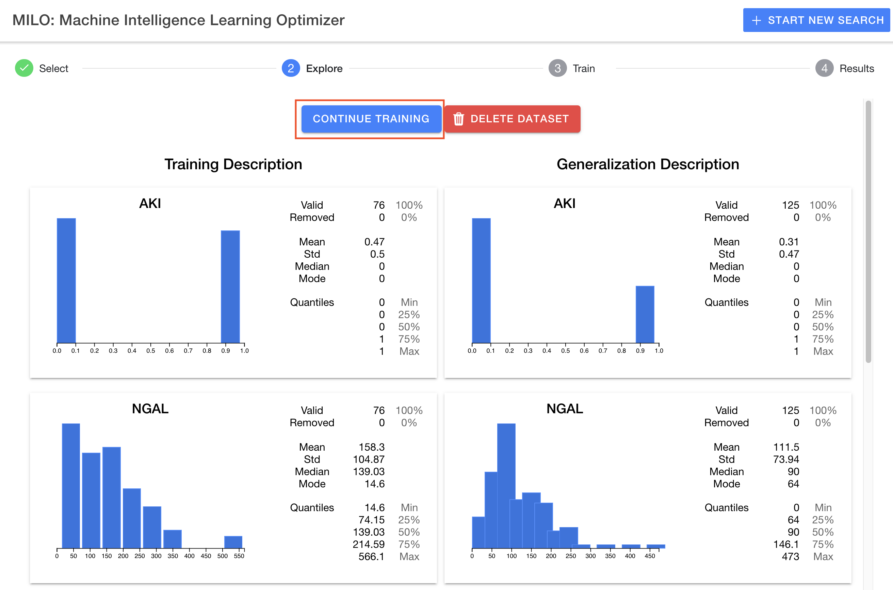

# Step 2: "Explore" (Analyzing your data before the machine learning steps)

After uploading your data, MILO will proceed to step 2 (the "Explore" step) which will show a simple statistical analysis of both datasets uploaded side by side allowing you to compare the data distribution between the two imported datasets and within each of their features and target (see below).

## Simple statistical overview

A two-column approach is taken to show both training and generalization datasets (as shown above). The target (top) and features (subsequent) will be listed under each column for each dataset, displaying as:

Each card displays a histogram for general distribution understanding as well as some basic statistical analysis for each feature.

## Adding additional runs and deleting runs

This step also allows you to manage runs for a particular dataset , delete a dataset and most importantly moving to the next step (step 3: "Train") by clicking the "Continue Training" button (as shown below).

Note: If you have a previous run for a given dataset, you will instead start a new run using the `Previous Runs` column using the `New Run` button.
