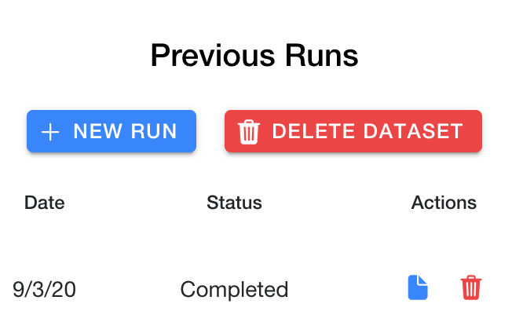

# Analyzing your dataset

After uploading your data, MILO will proceed to the next step which will show a simple statistical analysis of both datasets uploaded side by side allowing you to compare the data distribution between the two.

This step also allows you to manage runs for a particular dataset and delete a dataset.

## Simple statistical overview

A two column approach is taken to show both training and generalization datasets. The target (top) and features (subsequent) will be listed under each column for each dataset, displaying as:

Each card displays a histogram for general distribution understanding as well as some basic statistical analysis for each feature.

## Adding additional runs and deleting runs

To start a new run, look for the `Continue Training` button:

If you have a previous run for a given dataset, you will instead start a new run using the `Previous Runs` column using the `New Run` button:

As shown in the image above, you may delete a run by hitting the red trash can icon.

## Deleting a dataset

Additionally, you may delete the entire dataset using the red `Delete Dataset` button as shown above.

## Viewing run results

If you have a completed run in your previous runs list, you can click the blue document icon to open the results.
