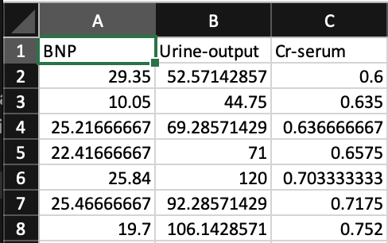
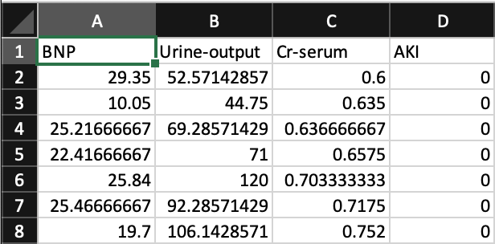

# Dataset Preparation

Data can come in all shapes and sizes however in order for your data to be used with MILO it needs to first be compatible and second structured in a specific way. This guide will walk you through those steps to quickly prepare your data.

## Types of compatible data

MILO uses numerical data only and therefore is not compatible with data such as images, audio, video, graphic, textual or other non-numeric data formats. In some instances, invalid formats can be converted into a numeric representation allowing MILO to function properly. For example, if you have textual data such as "Low", "Medium", and "High" then you could encode these into 1, 2 and 3 respectively.

Additionally, your data might be spread across several databases or spreadsheets and will need to be joined or flattened into a single table. The result will look something similar to the below spreadsheet:

::: tip
Notice the first row contains the column headers which allows your model to have named inputs
:::

## Defining the model target

Once you have gathered your data, you need to add one additional column which represents the target of your model. MILO only allows for binary classification based models meaning everything under the target is valued at either 0 or 1 representing states like negative or positive, not-present or present, etc.

::: tip
Notice the last column now contains a new column and the values below it represent a negative value for the listed row.
:::

## Assessing data completeness

## Creating the two required datasets
