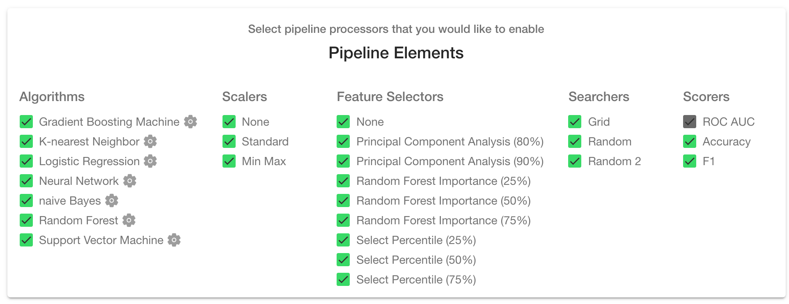

# Step 3: "Train"

The "Train" page is the brain of MILO and gives rise to the large number of ML pipelines (combinations of the various ML elements and steps shown below, such as algorithms, scalers, feature selectors, searchers and scorers) that ultimately allows MILO to build the thousands of ML models of interest.

Before a new run can begin, some options must be configured which will be explained in this section. Keep in mind the default configuration is to enable all options and is the recommended approach. Removing any of the pre-selected options will reduce the chance of finding one’s best model. Although it will speed up the run since less ML pipelines (i.e., combinations of each algorithm with their respective scaler, feature selector, hyperparameter searcher and scorer) are constructed.

For additional information on each configuration option please reference the following review article which highlights how each algorithm works: [Artificial Intelligence and Machine Learning in Pathology: The Present Landscape of Supervised Methods].
<https://journals.sagepub.com/doi/pdf/10.1177/2374289519873088>).

## Shuffle

Each time the data is split internally, we can choose to shuffle the data to ensure the order of the data is not influencing the model. The default is to have this option checked however it is configurable and can be unchecked if you choose to do so.

