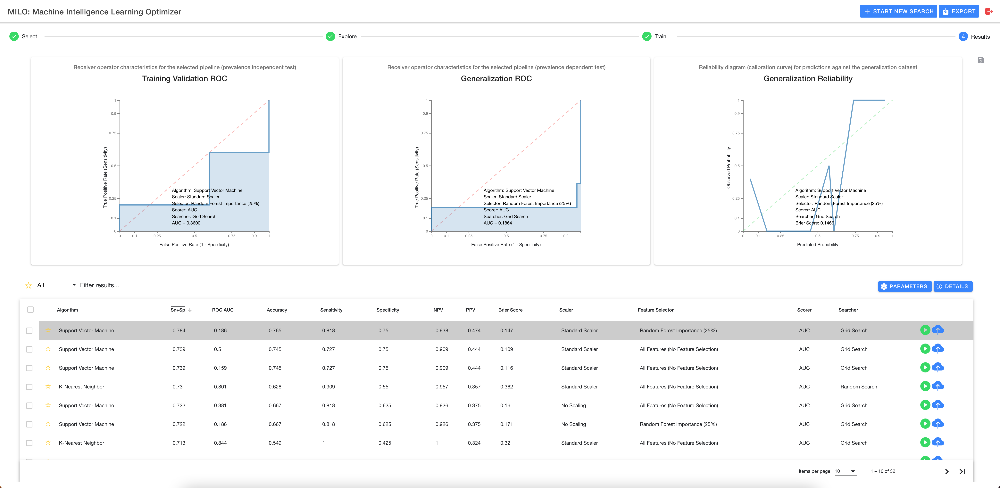
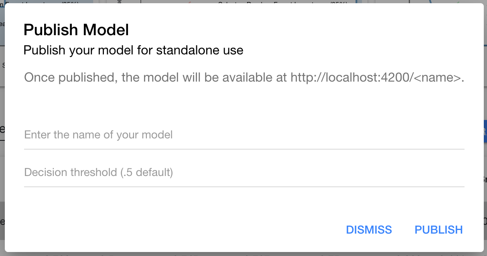

# Model results

Once a run is completed, you will automatically be taken to the results page. Here you can view all pipelines run and their statistical performance against your generalization dataset.

## Overview

In the image above you will see 3 graphs at the top and a table below them. The graphs represent details for the selected model in the table below. As you select new models, the graphs will update for the corresponding data.

## Table options

The table itself is very flexible and offers many options. First, on the left hand side, you will notice a star which allows you to mark models as favorites. You may also use the header bar star to toggle showing only favorites.

Next is the table filter which allows you to drill down on results in a variety of ways. Using the `All` drop down, you can filter on all aspects of a run whereas selecting specific options from the drop down ensure the filter only applies to that aspect of the model.

You may also tap on any header element to sort the table using that field. The header button can be tapped again to change the sort from descending to ascending.

## Export results

Next to the graphs, you will see a save icon which allows you to export PNGs of all three graphs.

Additionally, there is an export button at the top header which allows a CSV export of the entire table of results for viewing in any spreadsheet editor.

## Run details

In order to see details about the run from here, you may select one of the two buttons located above the table (below the graphs). The first button, `Parameters` allows you to see which pipeline elements selected during step 3. The second button, `Details` gives you some basic information about the number of models built as shown below:

## Test model

Each row of a model will have a green play button indicating the ability to run the model for ad hoc testing. Please see the [Test model](./test-model.md) documentation for more detail.

## Publish model

Each row of a model will have a blue upload button indicating the ability to publish the model for dedicated access to test against the model.

Once selected, you will be presented with a modal to name your model and if desired, change the default decision threshold (leave empty to use the default value of .5).

Please see the [Publish model](./publish-model.md) documentation for more detail.
