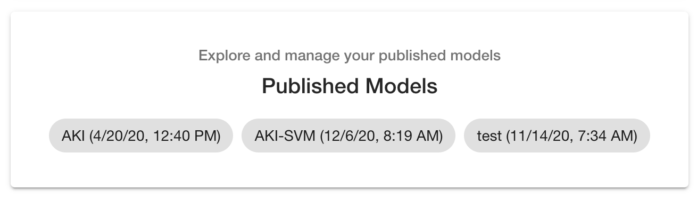
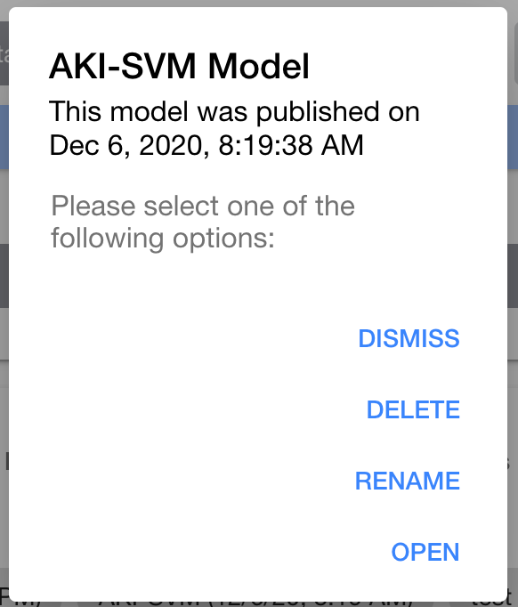

# Publish model

A published model allows users to visit a dedicated page for the model and perform tests against the model.

## Publish new model

You may publish a model from the [Model results](./model-results.md#publish-model) page. Please follow those steps to publish a model.

## Access published model

When you successfully create a model, you will be provided a URL to access the published model. This will appear as follows:

You will notice a link to access your published model which corresponds to the current host being used to access MILO combined with `model/<name>` where `<name>` is the name of the published model you provided in the creation step. This is the URL you can provide to stakeholders to test the model published.

## Delete published model

Removing a published model can be done on the home page of the MILO application (also referred to as [Step 1](./selecting-dataset.md)).

If you have a published model, you will see a new section at the bottom of the page, shown below:

Clicking the name of the model allows you to manage the published model by presenting the following popup:

From here you may delete the published model, rename the model or open the model in a new tab.
