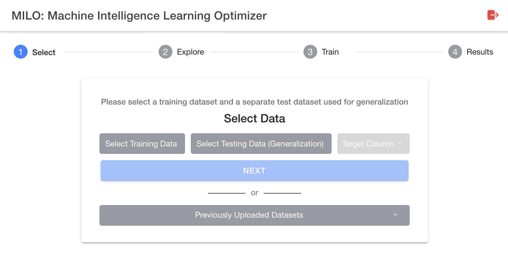

# Selecting your dataset

Once your two required datasets are prepared for a given binary classification problem you can begin uploading the data to MILO. This guide will walk you through the few steps required to get your data into MILO.

## Login

Your facilitator should have provided you a URL to access MILO via your web browser. Open this URL in your browser and you should be presented with a screen such as:

## Upload new dataset

Once you are logged in, you should be presented with the home page presenting you with data upload interface:

From here, you may select your training data and subsequently your generalization data that you prepared in the prior steps.

After selecting your two datasets, you will need to select your target column name. This is the target column you added in the [dataset preparation step](/guide/dataset-preparation.html#defining-the-model-target).

## Select previously uploaded dataset

If you have previously uploaded a dataset, you do not need to upload it again for additional searches. You may select from prior uploaded datasets by clicking the previously uploaded datasets button:

After clicking the button you will be presented with a modal to select the dataset:

