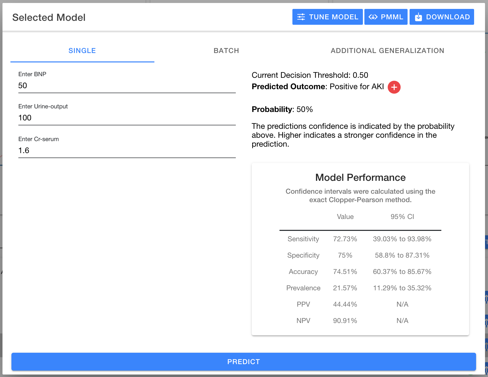
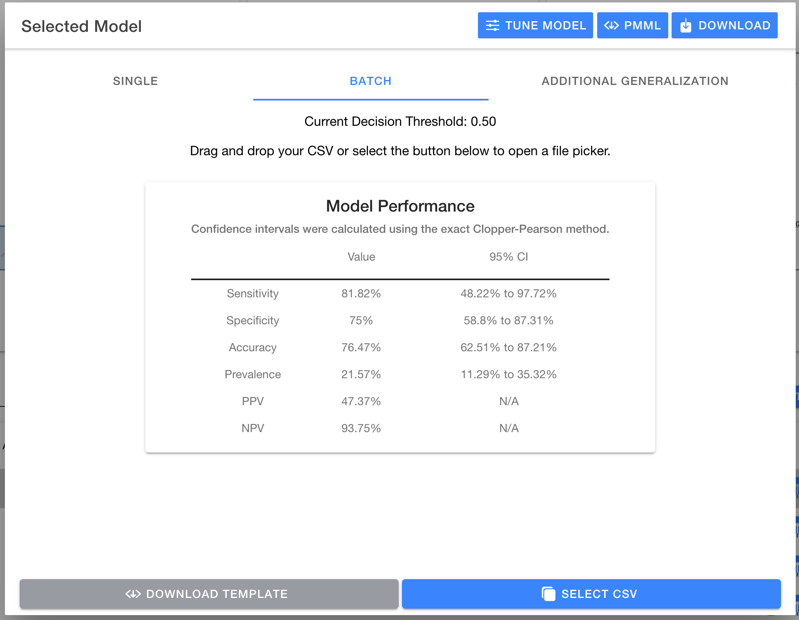
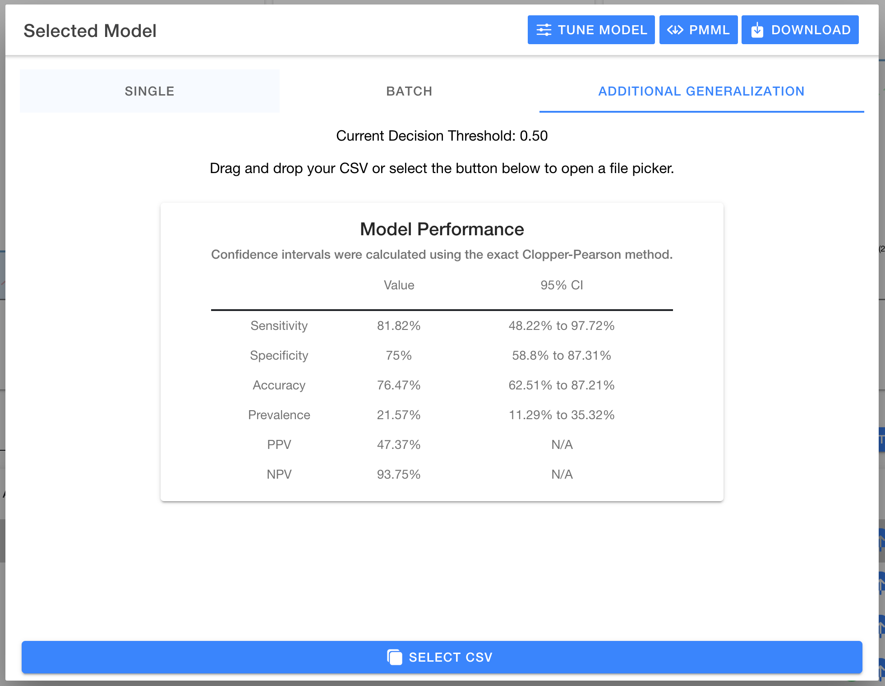

# Test model

Testing a model allows you to provide additional input data and get a predication from the selected model.

## Manual entry

Data can be input ad hoc using the `Single` entry fields allowing a predication to be calculated on the entered data. The result will be displayed in the modal on the right hand side along with a graphic indicating positive or negative.

Once a predication is made, the right hand side will show the predicated outcome and the probability of the outcome.

## Decision Threshold

Every model defaults to using 0.5 as the decision threshold meaning if the probability for an outcome is below 50% then the prediction is negative versus 50% or greater is marked as positive.

The decision threshold can be adjusted between a range of 0.3 to 0.7. This allows predicated outcomes to reflect this new decision threshold.

The `Tune Model` button allows you to adjust model characteristics including the decision threshold. This will show a modal as shown here:

## Batch entry

Additionally, you may provide a spreadsheet of data for use in the `Batch` mode. This allows the model to predict on every row of data and adds a new column at the end which contains the target column and the predicated outcome. An additional column is also added to show the probability of each outcome.

## Additional Generalization

Lastly, you may pass labeled data (similar to the generalization data set uploaded in [Step 1](./selecting-dataset.md)) and have the `Model Performance` be re-calculated for the provided dataset. The result will be shown in the modal replacing the previous performance.

## Download PMML

Predictive Model Markup Language (PMML) is an interchange format using XML allowing a model to be exported out of MILO and used in an outside scope (e.g. Epic EHR). To download the PMML if your model, simply use the `PMML` button in the header of the modal.

## Download joblib

An addition to PMML export of a model, you may also export a pickled version of the model which can be used in Python applications to directly restore the model into memory. To download the pickled model, simply use the `Download` button in the header of the modal.
