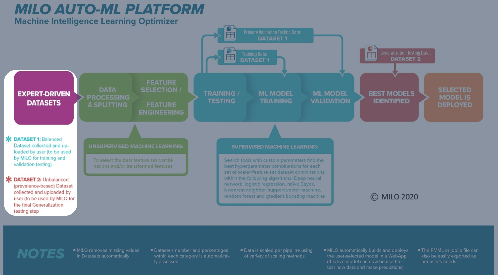

# Dataset Preparation

Data can come in all types, shapes and sizes (numbers, images, texts), however in order for your data to be used within MILO-ML, it needs to be first structured in a specific way so that it is compatible with MILO-ML.

The data "type" compatible within MILO-ML needs to be in the form of a numerical dataset (non-image and non-text). If the dataset includes text (e.g., Yes vs No, Male vs Female, Type A vs Type B vs Type C, etc.), that text will first need to be converted into a numerical value so that it is MILO-ML-compatible (e.g., 0 for No vs 1 for Yes, or 0 for Type A vs 1 for Type B vs 2 for Type C, etc.).

The data "shape" compatible within MILO-ML is also very important and needs to be in the form of a csv file (note: these can be easily made within one's Excel dataset file by saving the single Excel sheet as a csv file). The final csv file will need to include a set of features (i.e., variables) and a single target column with class labels to map the features to the target classes. MILO-ML now supports both **binary classification** (2 classes: 0s and 1s) and **multi-class classification** (3+ classes: 0, 1, 2, 3, etc.).

## Classification Types

### Binary Classification
For traditional binary problems (e.g., Cancer versus No-Cancer), the target should contain:
- **0s** representing the negative cases (e.g., No-Cancer)
- **1s** representing the positive cases (e.g., Cancer)

### Multi-class Classification  
For problems with 3 or more categories (e.g., Disease Type A vs B vs C, or severity levels), the target should contain:
- **0, 1, 2, 3...** representing each class sequentially
- Each number corresponds to a different category/class

## Dataset Requirements

In summary, regardless of whether you're doing binary or multi-class classification, the following 3 things are required of the datasets for getting started in MILO-ML:

1. **Two csv datasets (numerical-based) are required**

    - The first dataset (known as "Training dataset") is for training/initial validation (i.e., MILO-ML will automatically take this dataset and do an 80-20 split with cross validation. This means 80% of the Training dataset is used for training/building the models and 20% withheld for the initial test validation while being cross validated 10 times for statistical integrity within MILO-ML's model building phase).
    - The second dataset (known as "Generalization dataset") is solely used for the generalization/secondary testing of all the models that were generated from the aforementioned build phase of MILO-ML from the "Training dataset" noted above. This second dataset should preferably also represent the true prevalence of the target classes that is being tested on those models to better represent the model's true performance.

    Examples of such datasets are shown in the figures below.

    In an optimal setting, the first dataset should be a retrospective dataset while the second dataset should preferably represent the follow up prospective dataset for that study. However, in real life this may not always be available, and one may need to heuristically build the 2 datasets required from a single retrospective dataset as an initial proof of concept study.

    ::: tip
    Note: The models generated from these pilot studies should then be further validated on additional tertiary and quaternary independent prospective datasets before they can be even considered for deployment or considered being used as a predictive analytics tool.
    :::

2. **A classification target column is required**

    - In each dataset, generally the last column represents the desired target within MILO-ML. The target needs to be in numerical format representing the different classes.
    - **Binary Classification**: Target should contain 0s and 1s (negative and positive cases respectively)
    - **Multi-class Classification**: Target should contain 0, 1, 2, 3... representing each class sequentially
    - In the sample cancer datasets provided, Cancer status serves as the target (i.e., Cancer versus No-Cancer cases). The positive cases (Cancer) are depicted as 1s while the negative Cancer cases are assigned as 0s.
    - For multi-class examples, you might have disease severity levels (0=Mild, 1=Moderate, 2=Severe) or disease types (0=Type A, 1=Type B, 2=Type C).

3. **A set of "features/variables" columns are required**

    To build/train each ML model within MILO-ML, both datasets (the first/training and second/generalization testing datasets mentioned above) must also include a set of features (AKA variables or attributes) which will need to be identical and in the same column order within both datasets. These features/variables are then mapped to each target class to ultimately build the final ML model within MILO-ML's platform which will then be able to predict the class membership on future unknown cases based on their unique feature characteristics.

## Dataset Balance Recommendations

- **Training dataset**: Should preferably be balanced between all classes for optimal model performance
- **Generalization dataset**: Should be more reflective of the target classes' true prevalence in the real-world scenario

## Custom Class Labels

MILO-ML supports custom class labels for better interpretability:
- You can provide meaningful names for your classes (e.g., "Healthy", "Mild Disease", "Severe Disease")
- These labels will be displayed throughout the interface and results
- The underlying numerical values (0, 1, 2...) are used for computation while your custom labels are shown for clarity

## Types of compatible data

As mentioned earlier, MILO-ML uses numerical data only and therefore is not compatible with images, audio, video, graphic, textual or other non-numeric data formats. In some instances, invalid formats can be converted into a numeric representation allowing MILO-ML to function properly. For example, if you have textual data such as "Low", "Medium", and "High" then you could encode these into 0, 1 and 2 respectively (if appropriate).

Additionally, your data might be spread across several databases or spreadsheets and will need to be joined or flattened into a single table since that is what's needed to generate the MILO-ML-compatible csv file. The result will look something similar to the below spreadsheet:

::: tip
Notice the first row contains the column headers in which the first 3 columns represent the features/variables and the last column represents the target in this dataset.
:::

## Defining the model target

As noted above, once you have gathered your data, you need to select the labeled column that represents your classification target for your model. MILO-ML supports both binary and multi-class classification, meaning everything under the target column should be valued using sequential integers starting from 0.

**Examples:**
- **Binary**: 0 (negative) and 1 (positive)
- **Multi-class**: 0, 1, 2 (for 3 classes), or 0, 1, 2, 3 (for 4 classes), etc.

Note: If you are concurrently evaluating the sample Cancer dataset (which is provided for your convenience), you will notice the last column (i.e., target column) in those csv dataset files are labeled as "Cancer", with the positive cases listed as 1s and the negative cases listed as 0s.

Now that your two required datasets are prepared for a given classification problem, you can begin uploading the data into MILO-ML. The next several sections within this guide will walk you through MILO-ML's aforementioned 4 steps which will ultimately give rise to the ML model of your interest.

If this is your first-time using MILO-ML, we recommend using the sample Cancer dataset (that is provided to you here) for your first MILO-ML test run. Also, for this first test run, we recommend starting with a smaller number of faster algorithms (i.e., Logistic regression and Support vector machine algorithms selected within MILO-ML) so that the build phase can be completed in a much faster pace. This way you can get introduced to the various MILO-ML capabilities in a much more efficient manner and without a hiccup as you go through this guide while getting to know the various analytics tools that MILO-ML can offer during and after each run.

Note: For your future real MILO-ML runs (on your own datasets) we recommend running all algorithms and permutations within MILO-ML to optimize your chance of finding the best performing ML model for your given study. However, those full runs take a while to complete so for the sake of this tutorial, it is best to test with a limited number of simpler algorithms (e.g., Logistic regression and Support vector machine) as noted earlier.

Now that you are familiar with what is required to become a MILO-ML-compatible dataset, let's start going through MILO-ML.