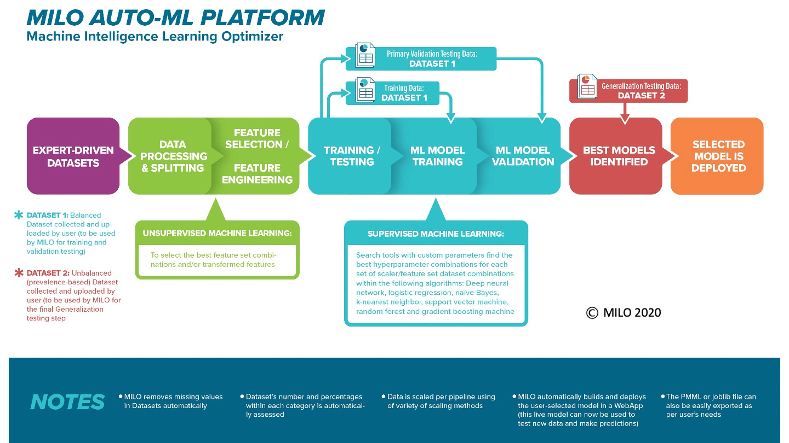

# Let’s get started

Now that you have finished reviewing the 2 suggested articles listed above and have downloaded the 2 sample public domain datasets, it is time to open these 2 sample datasets (Training and Generalization testing "Cancer" datasets) on your computer to become familiar with the various aspects of a MILO-ML-compatible dataset as you go through this guide. As noted earlier, these datasets can be found at the "Sample datasets" section of this guide. You can use this dataset to walk through the remaining parts of this step-by-step tutorial.

This guide starts with the MILO-ML infrastructure overview, followed by the steps needed to acquire and structure your data in a format that is usable within MILO-ML and how it is ultimately able to deliver the model(s) that serve you best (note: the sample cancer datasets provided here have already been structured to a MILO-ML-compatible format. Please use these as examples of what your future datasets should be formatted like).

The diagram below highlights the MILO-ML overview infrastructure and how it is able to deliver the model(s) that serve you best. This infrastructure starts with importing the compatible datasets, followed by various processing and scaling approaches along with the incorporation of several known unsupervised machine learning/ statistical methods (e.g. PCA, ANOVA Select Percentile or Random Forest importance's feature selectors) which then feed into MILO-ML’s embedded supervised ML platform that uses a large number of known ML algorithms/methods (i.e. Support Vector Machine, Logistic Regression, K-nearest neighbor, Naïve Bayes, Random Forest, Neural network, and gradient boosting machine) to ultimately build and assess the models required for ones given task.

Once, the models are built and validated through MILO-ML, if their performance meet your acceptance, you can then use MILO-ML’s simple deployment tools that will allow one to fix and deploy such an ML model for making new predictions on additional/future data. Notably, MILO-ML’s platform follows data science/ machine learning best practices (Rashidi et. al. 2019) and most importantly is validated on several known published studies (e.g., Tran et. al 2020, Rashidi et. al. 2020, Jen et. al. 2021).

This tutorial will walk you step-by-step through MILO-ML's very friendly user interface that correlates with the aforementioned overview infrastructure shown above. Ultimately, allowing you to automatically build ML models that fits your needs.

The user interface in MILO-ML follows a simple 4 step process (as shown in the image below).
This simple 4 step approach within MILO-ML’s user interface (1-Select, 2-Explore, 3-Train and 4-Results) highlights its very intuitive layout. The first step (1-Select) allows the user to import their required datasets and to select their target for the binary classification task. Step 2 (Explore) allows the user to inspect their dataset along with their feature/variable and target characteristics, before any of the machine learning approaches have been implemented. Step 3 (Train) is the brain of MILO-ML in which a large combination of ML components with a variety of unsupervised and supervised algorithms ultimately give rise to a very large number of unique ML pipelines (i.e., combination of various scalars, scorers, algorithms, feature selectors, and hyperparameter searchers) that ultimately generate thousands of unique ML models. Step 4 (Results) allows the user to visualize the results of the models constructed through the MILO-ML platform (i.e., how the models are statistically performing in distinguishing the binary target based on the secondary/generalization dataset).

Now that you have a better sense of MILO-ML’s big picture, lets dive in deeper into each of the steps.

The next several sections within this documentation guide will walk you through the details of the 4 steps mentioned above. However, before getting started, it is essential to understand the basic dataset requirements to ensure data compatibility within MILO-ML. Hence, before jumping into the core 4 steps noted above, we will first need to review certain key elements of your desired dataset which includes but is not limited to data preparation, compatibility, evaluation of data completeness and it’s uploading needs.

