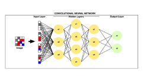

# Glossary: Common machine learning terms in MILO-ML

| Term | Definition | Example(s) |
| --- | --- | --- |
| Algorithms | These are the supervised machine learning (ML) methods that are included within the MILO-ML platform that are able to construct the binary classification models. The supervised methods employed within MILO-ML include some of the most commonly used ML algorithms such as Logistic Regression (LR), Random Forest (RF), Naïve Bayes (NB), K-Nearest Neighbor (KNN), Gradient Boosting Machine/ XGBoost (GBM), Neural Network (DNN) and Support Vector Machine (SVM). A more detailed explanation of these methods can be found below (alphabetically) | Many of the algorithms mentioned are shown in the image below (notably, MILO-ML at this point is a classification Auto-ML engine only and is not able to employ linear regression or other regression tasks). The following review article (see link below) is recommended which not only gives one a more detailed look of these various supervised machine learning methods but also an insight into best practice approaches for one’s ML study design, etc. <https://journals.sagepub.com/doi/full/10.1177/2374289519873088>  Rashidi et.al. Academic Pathology 2019 |
| Bias-Variance trade off | This refers to finding the right balance between bias and variance in an ML model, with the ultimate goal of finding the most generalizable model. Notably, increased bias usually leads to an underfitted model while increased variance may lead to overfitting. Finding the happy balance between the bias and variance is the key to finding the most generalizable model. MILO-ML’s unique platform (with the help of its hyperparameter searchers and its performance dependency on the secondary dataset) minimizes the overfitting phenomena. By making no assumptions about any feature sets or supervised algorithms, this will ultimately increase the chance of finding the best performing models for one’s given binary classification task |  Rashidi et.al. Academic Pathology 2019 |
| Boosted Tree | An ensemble method that uses weak predictors (e.g. decision trees) that can ultimately be boosted and lead to a better performing model (i.e. the boosted tree). | also Gradient Boosting Machine (GBM) |
| Bootstrapping | To randomly pull samples from the original dataset for creating a new dataset of the same size. Note: “Bagging” is a term that is related to this which stands for Bootstrapping aggregation. This ensemble approach uses the aggregated data to make a decision by initially building multiple models on a subset of data whose predictions are ultimately then combined to make the final prediction. | Regularly used in certain ensemble decision tree algorithms such as random forest |
| Categorical data/features | These include features that have discrete values and are often binary. Although not infrequently, more than 2 categories have also been used. | Patients with diabetes and patients without diabetes is an example of binary classification (what’s allowed in MILO-ML) |
| Class | Refers to the labeled target values | For a binary classification of cancer diagnosis, the classes could be cancer versus no cancer designated as the targets |
| Classification modeling | A supervised machine learning approach that builds models that are able to distinguish 2 or more discrete classes | Cancer versus no cancer |
| Classification threshold | This is usually the probability/value threshold that allows the model to be able to separate the 2 classes. | If one has used the default probability value of 0.5 in our logistic regression-based model to separate the positive cases of cancer from the negative cases of cancer, the positive cases are those that are >=0.5 and the negative cases are those that are <0.5. Within MILO-ML, one can also fine-tune each model (if needed) by adjusting the probability thresholds (e.g. changing it from 0.5 to 0.4, etc.) after the model has been built to enhance the final model’s performance measures. |
| Confusion matrix | Summarizes the model’s predictions. Specifically denoting the true positive, true negative, false positive and false negative predictions. These values will then make it possible to calculate the various performance measures of our model (e.g. accuracy, sensitivity, specificity, etc.) |  |
| Convolutional Neural network (CNN) | These are usually deep neural networks with at least one convolutional layer and that are well suited for certain complex tasks such as image recognition/ classification. These are more commonly used within image-based ML studies (which is not something MILO-ML can do at this point) | As oppose to the CNNs mentioned within a transfer learning approach that are more commonly used within image-based ML studies, the MILO-ML neural networks are multilayer perceptron (MLP) based models  |
| Cross Industry Standard Process for Data Mining (CRISP-DM) | A systematic approach to supervised machine learning process that includes the following steps: Data collection and processing, feature selection/transformation, followed by model building and validation steps and ultimately the model deployment step. |  |
| Cross Validation | A way to statistically estimate the model’s generalizability by withholding one or more internal test sets which can then be tested against the trained model(s). | k-fold cross validation (see K entry terms in the glossary below) |
| Data types | Data within ML platforms are best categorized into the following 4 types: Numerical (exact numbers), Text (which will need to be converted to numbers), Categorical (represents characteristics such as normal tissue vs. cancer, etc.), and Time-series (sequence of numbers collected over time intervals). | An example of categorical is normal tissue versus cancer cases. Note: 7 data type grouping has also been proposed which include: Useless, Nominal, Binary, Ordinal, Count, Time and Interval data. Please also note that MILO-ML is not compatible with image datasets and texts. MILO-ML’s platform is meant for a variety of numerical datasets. |
| Decision boundary | This refers to the boundary between the classes that is learned by the machine learning model. In the example the dashed lines represent the best decision boundaries that separate the classes (black group, and the red group). |  |
| Decision tree | These use a flowchart structure that typically contains a root, internal nodes, branches, and leaves. The internal node is where the attribute in question (e.g. creatinine >1 or creatine <1) is tested while the branch is where the outcome of this tested question is then delegated. The leaves are where the final class label is assigned which, in short represents the final decision after the results of all the attributes have been incorporated. The end result of the decision tree is a set of rules that governs the path from the root to the leaves. Examples include, Simple Decision tree (not often used) or Boosted Tree (Gradient Boosting Machine) or Random Forest. | Random Forest (As an example of an ensemble of decision trees)  |
| Deep Neural Network (DNN) | Refers to a neural network with multiple hidden layers and a large number of nodal connections. Common deep neural networks that are currently used within the image analysis field include AlexNet, Inception which is also known as GoogleLeNet (e.g. Inception-v3) and ResNet (e.g. ResNet50). These are commonly employed in various transfer learning projects. These are more commonly used within image-based ML studies (which is not something MILO-ML can do at this point). MILO-ML’s neural network platform uses multilayer perceptron platforms (MLPs) without any transfer learning. | As oppose to the CNNs mentioned within a transfer learning approach that are more commonly used within image-based ML studies, the MILO-ML neural networks are multilayer perceptron (MLP) based models  |
| Discrete | Qualitative targets or features within a classification schema in supervised learning. | Examples of discrete targets may include Cancer versus Normal tissue or Acute kidney injury (AKI) versus No- AKI in a classification ML model. This is in contrast to quantitative targets that can be used within supervised learning models and that can then also be used to predict a numerical outcome as in a linear regression model. |
| Feature | Refers to the input variables that are used to map to the target in a model | For example, in an acute kidney injury (AKI) model certain features such creatinine, urine output and NGAL may be used to map to its Target categories (AKI versus No-AKI) which would ultimately make it possible to build a model that can predict AKI |
| Feature engineering | This the process that allows for the selection of certain key features or the transformation/conversion of certain features within a dataset that will ultimately lead to a better prediction model | A dataset with a large number of features can be refined by certain methods (e.g. PCA or K-Best, etc.) to find the most relevant features (within all features) based on various statistical methods). This can then be used within the algorithm to build a new model. For example a dataset with 20 features or more can be refined though PCA or K-Best to a new dataset with 10 or less features. |
| Generalizability | The ability of a model to accurately predict on new previously unseen test sets (secondary or tertiary test sets) that were completely outside of the training dataset. | In machine learning, the validation accuracy typically refers to the model’s accuracy based on the primary test set which was created with the dataset that was used to train the model within its train-test split phase. In contrast, the generalization accuracy is a new test set that is used to test the final model and its capability of predicting using previously unseen data. |
| Generalization test set | The secondary or tertiary test set that is unknown to the initial train-test split data set and used to assess the model’s generalizability | A cancer predicting model trained with images from one institution can be tested for its generalizability using another institution’s images as a secondary test set. |
| Input variables | These usually refer to the features from the training data | In a cancer predicting model trained with cancer and no-cancer images, the image features within cancer are used to map to the cancer labeled group while the image features of the benign group are mapped to the no-cancer group |
| K-fold cross validation (CV) | A type of cross validation in which the train-test dataset is split k times. | If the k is 10 in the k-fold CV, the data is split into 10 train-test splits to assure proper sampling of the training set and more importantly of the testing data. |
| K-means | An unsupervised method that utilizes discrete or continuous data as its input parameter for identifying input regularities (i.e. clusters) | Clustering a medical dataset to characterize subpopulations of a disease based on various known input clinical parameters |
| K-nearest neighbor (KNN) | a non-parametric clustering algorithm used for data classification and regression. Classification is based on the number of k neighbors, where k is equal to the square root of the number of instances, and its distance (e.g., Euclidean) from a pre-defined point |  |
| Kernel trick | Allows the data to be transformed into another dimension (e.g. z-plane) which ultimately enhances the dividing margin between the classes of interest | See SVM example below  |
| Leave One Out cross validation | The extreme version of the k-fold CV approach in which k will equal to n (e.g., total number patients being studied). Instead of train-test, splitting them into k-folds of 5 or 10 (as in k-fold CV studies). As the name implies, by leaving one out each time for each cross validation step, k will then equal to the total number of individual data entries n (e.g., n of 100 could be the individual sets of data in 100 patients). | e.g. n of 100 could be the individual sets of data in 100 patients. Hence, the k-fold CV in this case will split the data into 100 train-test splits which assures full sampling |
| Linear Regression | This algorithm allow us to find the target variable (usually a numerical value) by finding the best fitted straight line which is also known as the “least squares regression line” (the best dotted line with the lowest error sum) between the independent variables (the cause or features) and dependent variables (the effect or target). The ultimate goal of this technique is to fit a straight line to the dataset in question. |  Note: regression is not currently available through MILO-ML since it’s a classification platform only |
| Logistic Regression | The term regression is somewhat of a misnomer since in general this is a classification method that uses a logistic function for predicting a dichotomous dependent variable (target). |  |
| Loss | It measures how poorly the model is performing when comparing its predictions to the target labels.  Hence, typically the lower the loss, the better the model. | e.g. measuring “log loss” in logistic regression models and “mean squared error” (MSE) in linear regression models |
| Machine Learning (ML) | Machine-based intelligence (in contrast to natural human intelligence). Also interchangeably used with the term Artificial intelligence (AI). Paraphrasing Arthur Samuel and others, ML models are built by a set of data points trained through mathematical and statistical approaches that ultimately enable prediction of new previously unseen data without being explicitly programmed. |  Rashidi et.al. Academic Pathology 2019 Please note that MILO-ML’s platform uses a combination of various Unsupervised and Supervised ML methods that ultimately give rise to a large number of ML models for one’s given binary classification task |
| Model | This usually refers to the end result of the machine learning algorithm’s training phase in which the variables are ultimately mapped to the desired target. | A deep neural network model that is trained to predict cancer from benign tissue or a k-NN model that is used to predict acute kidney injury (AKI) from no-AKI.
| Naïve Bayes | A classifier that uses a probabilistic approach based on the Bayes theorem. This approach assumes the naïve notion that the features being evaluated are independent of each other | Note: Naïve Bayes, not surprisingly, will not have hyperparameters to tune within the MILO-ML platform |
| Natural Language Processing (NLP) | A machine learning (ML) process that enables computers to learn and ultimately analyze human (natural) language data. This may include various aspects of speech, syntax, semantics, and discourse (oral and written).| Apple’s Siri or Amazon’s Alexa. NOTE: NLP and image-based ML studies are currently not available through the MILO-ML platform (MILO-ML is made for non-image-based automated binary classification tasks) |
| Normalization | A standardization or scaling procedure that is often used in the processing phase of the data in preparation for machine learning. Certain methods (e.g. distance-based algorithms) within machine learning (e.g. k-NN) are very sensitive to unscaled data. Hence, in the absence of scaling (i.e. normalization) they may not perform as expected. Usually, normalizing the data for such algorithms improves their overall performance. | e.g. Standard scaler (Scales the data so that the mean of the distribution is set to 0 with a standard deviation of 1) |
| Overfitting | This gives rise to the model appearing as a good predictor on the training data while underperforming on future new and previously unseen data (i.e., not generalizable). This is due to its a low bias and high variance in which the model may now adapt too strongly to the data which could have included noise. |  |
| Parametric algorithm | The set of parameters in a parametric algorithm is fixed which confines the function to a known form. In general, the assumption within parametric algorithms is that the function is linear or assumes a normal distribution while non-parametric methods do not make such assumptions. | The most commonly encountered parametric algorithms include linear regression, logistic regression and naïve Bayes while some of the most common non-parametric algorithms include k-NN, SVM, CNN and decision trees including RF |
| Prediction | Refers to the model’s output based on some initial input variables | A deep neural network trained to identify cancer cases is tested against an unknown histologic image which predicts it as cancer with a certain probability. |
| Principal Component Analysis (PCA) | A statistical approach that can lower dimensional representations. This technique can highlight the contribution of various features within a dataset through its principal components which could ultimately allow a reduction in the number of features that are required to build the model | Within a dataset that contains, say, 8 features, 92% of the explained variance within the data may have been found to be contained within the first two principal components (PC1 and PC2) which were subsequently shown to be mainly due to 4 out of the 8 features. Then, those 4 features may be selected to build an ML model if one is looking to train a model with a smaller number of features |
| Random Forest (RF) | Uses a network of decision trees for ensemble learning. Using bootstrapping, this method generates randomly generated datasets that can then be used to train the data for building an ensemble of decision trees. Ultimately, each decision tree will determine an outcome, and a majority “vote” approach is used to classify the data. Appropriately, this is called random forest since a large number of randomly generated decision trees are used to construct the final model |  |
| Regularization | A process that helps to minimize the overfitting of an ML model by reducing the effect of noise. | This usually refers to adding some information to the process that ultimately reduces overfitting and makes the model a better predicting tool. |
| Reinforcement learning | These platforms may share features of both a supervised and an unsupervised process and usually function through a policy-based platform | IBM’s Watson and Google’s Go that were able to beat champion chess and Go players, respectively
| Scikit learn | A popular machine learning library that enables users to build and assess various ML models though a variety of supervised and unsupervised algorithms. Other commonly used ML libraries (besides Scikit learn) that are especially useful for image classification model building include Turi create and Tensor flow. | Building a classification model through its support vector machine or logistic regression algorithm. |
| Supervised learning | These platforms employ “labeled” training data sets (labeled/supervised by subject experts) to yield a qualitative or quantitative output. The two major categories of supervised learning are classification and regression which lead to discrete/qualitative and continuous/quantitative targets, respectively. | Classification models & Regression models Note: MILO-ML is a binary “Classification” Auto-ML approach |
| Support Vector Machine (SVM) | Classifies data by defining a hyperplane that best differentiates two groups. This differentiation is maximized by increasing the margin (the distance) on either side of this hyperplane. In the end, the hyperplane-bounded region with the largest possible margin is used for analysis. One of the key highlights of the SVM method is its ability to find non-linear relationships through the use of a kernel function (kernel trick). |  |
| Target | Within supervised machine learning (ML), the target is also sometimes referred to as the label which is comprised of the results or classes that one seeks to find. | In a supervised ML model for cancer versus normal tissue, the “cancer” and “normal tissue” are the labels (targets). In MILO-ML, Cancer will typically be labeled as 1s and normal will be labeled as 0s. Another example could be Acute Kidney Injury (AKI) in which AKI positive cases are 1s and the negative cases are 0s. |
| Train-Test Split | A common approach employed in supervised machine learning in which a subset of the initial data is used to train the model and a subset that is set aside is used to test its initial validation. | A 80-20 Train-Test split is one in which 80% of the initial dataset is assigned to the training phase to build the models and 20% is kept behind and used to test the model’s initial performance. Within MILO-ML, this train-test split is done to the training dataset. MILO-ML does not use this initial performance measure from this first dataset as the model’s true performance since that could lead to exaggerated (overfitted) models. Hence, to minimize this overfitting phenomena,  after the model’s initial performance evaluation, MILO-ML then assesses each model’s performance against a secondary dataset (generalization dataset) as well to get a better sense of each model’s true performance (this is the main reported performance of the model within MILO-ML’s results table). |
| Underfitting | An underfitted model has a higher bias and lower variance. In this situation important potential inter-relationships between the data features may be ignored |  |
| Unsupervised learning | These involve agnostic aggregation of unlabeled data sets yielding groups or clusters of entities with shared similarities that may be unknown to the user prior to the analysis step. | Clustering or Dimensionality Reduction (e.g. PCA). Within MILO-ML a combination of various Unsupervised methods (e.g. Select percentile ANOVA feature selector, Random Forest feature Importances and PCA) are used to select or transform the feature sets within one’s training dataset which is then feed into the various Supervised algorithms (LR, KNN, DNN, SVM, NB, RF, and GBM) to build a large number of ML models for one’s given binary classification task.
| Validation testing | This usually refers to the initial validation testing phase in which the test set (e.g. 20% of the initial dataset) that was set aside from the train-test split is used to assess the model’s initial performance. This does not always correlate with the generalizability of the model. Hence, testing the model with secondary test sets is usually recommended (as required within the MILO-ML platform) | For example, in a model in which 20% of the initial dataset was kept behind and used to test the model’s performance, the model was found to be 92% accurate (it’s initial validation accuracy). However, using a secondary test set (generalization dataset) the model was found to be 81% accurate (the model’s likely generalizability/ true performance). Given these common findings, MILO-ML does not use this initial performance measure (e.g. 92%) from this first dataset as the model’s true performance since that could lead to exaggerated (overfitted) models. Hence, to minimize this overfitting phenomena,  after the model’s initial performance evaluation, MILO-ML then assesses each model’s performance against it’s required secondary dataset (generalization dataset) as well to get a better sense of each model’s true performance (81% as shown above) which is the main reported performance of the model that is reported within MILO-ML’s results table. |
