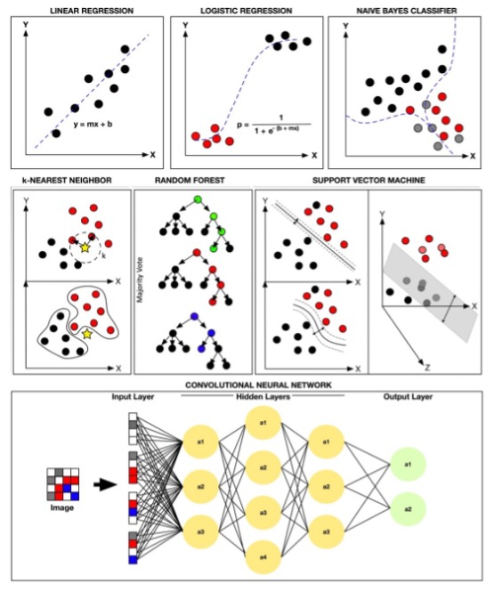
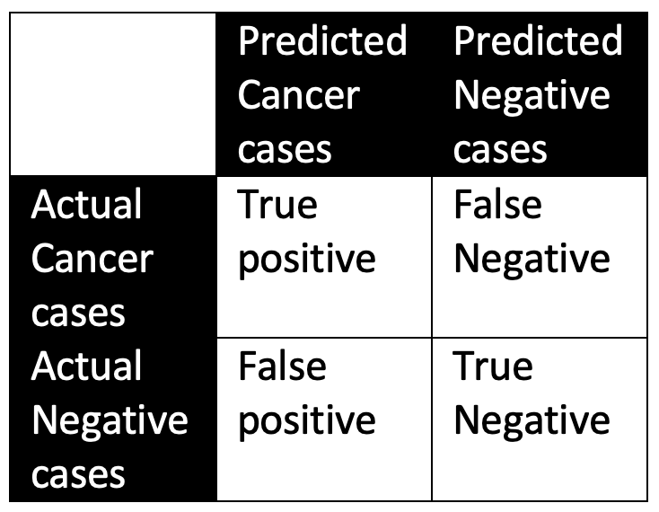
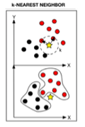
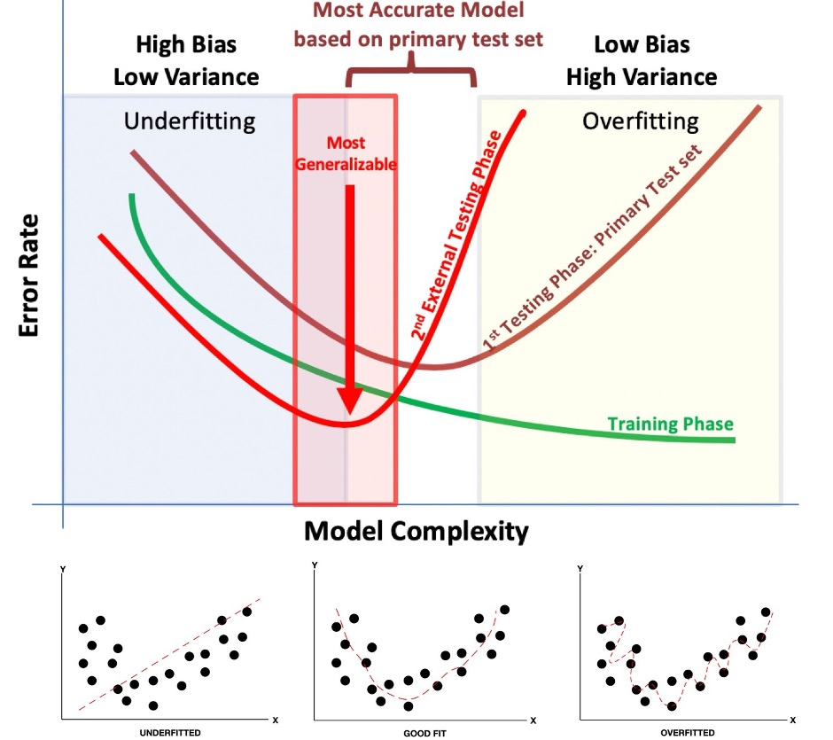

# Glossary: Common machine learning terms in MILO-ML

| Term | Definition | Example(s) |
| --- | --- | --- |
| Algorithms | These are the supervised machine learning (ML) methods that are included within the MILO-ML platform that are able to construct the classification models. The supervised methods employed within MILO-ML include some of the most commonly used ML algorithms such as Logistic Regression (LR), Random Forest (RF), Naïve Bayes (NB), K-Nearest Neighbor (KNN), Gradient Boosting Machine/ XGBoost (GBM), Neural Network (DNN) and Support Vector Machine (SVM). A more detailed explanation of these methods can be found below (alphabetically) | Many of the algorithms mentioned are shown in the image below (notably, MILO-ML supports both binary and multi-class classification Auto-ML engines). The following review article (see link below) is recommended which not only gives one a more detailed look of these various supervised machine learning methods but also an insight into best practice approaches for one's ML study design, etc. <https://journals.sagepub.com/doi/full/10.1177/2374289519873088>  Rashidi et.al. Academic Pathology 2019 |
| Binary Classification | A classification task with exactly two classes or categories | Cancer versus No-Cancer, Disease versus Healthy, Positive versus Negative |
| Multi-class Classification | A classification task with three or more classes or categories | Disease Type A vs B vs C, Severity levels (Mild/Moderate/Severe), Multiple diagnostic categories |
| Class | Refers to the labeled target values in classification problems | For binary classification: cancer versus no cancer. For multi-class: Disease Type A, Type B, Type C |
| Classification modeling | A supervised machine learning approach that builds models that are able to distinguish 2 or more discrete classes | Binary: Cancer versus no cancer. Multi-class: Disease severity (Mild/Moderate/Severe) |
| Classification threshold | This is usually the probability/value threshold that allows the model to be able to separate the classes. For multi-class problems, this applies to One-vs-Rest evaluations | If one has used the default probability value of 0.5 in a binary logistic regression-based model to separate the positive cases from the negative cases, the positive cases are those that are >=0.5 and the negative cases are those that are <0.5. Within MILO-ML, one can also fine-tune each model (if needed) by adjusting the probability thresholds after the model has been built to enhance the final model's performance measures. |
| Confusion matrix | Summarizes the model's predictions. For binary classification, denotes the true positive, true negative, false positive and false negative predictions. For multi-class, shows the prediction accuracy for each class pair. These values will then make it possible to calculate the various performance measures of our model (e.g. accuracy, sensitivity, specificity, etc.) |  |
| One-vs-Rest (OvR) | A strategy for handling multi-class classification by treating each class as a binary problem against all other classes combined | For a 3-class problem (A, B, C), OvR creates three binary classifiers: A vs (B+C), B vs (A+C), and C vs (A+B) |
| Macro-averaged metrics | Performance metrics calculated by averaging the metric across all classes, giving equal weight to each class regardless of class frequency | In a 3-class problem, macro-averaged precision would be (Precision_A + Precision_B + Precision_C) / 3 |
| Categorical data/features | These include features that have discrete values and are often binary or multi-categorical | Patients with diabetes vs without diabetes (binary), or Disease Type A vs B vs C (multi-class) |
| Custom Class Labels | User-defined meaningful names for classes instead of numerical values | Instead of showing "0, 1, 2", display "Healthy, Mild Disease, Severe Disease" |
| Discrete | Qualitative targets or features within a classification schema in supervised learning | Examples of discrete targets may include Cancer versus Normal tissue (binary) or Disease Type A versus Type B versus Type C (multi-class) in a classification ML model. This is in contrast to quantitative targets that can be used within supervised learning models and that can then also be used to predict a numerical outcome as in a linear regression model. |
| Feature | Refers to the input variables that are used to map to the target in a model | For example, in a disease classification model certain features such as age, symptoms, and lab values may be used to map to Target categories (Healthy/Disease Type A/Disease Type B/Disease Type C) which would ultimately make it possible to build a model that can predict disease type |
| Generalizability | The ability of a model to accurately predict on new previously unseen test sets (secondary or tertiary test sets) that were completely outside of the training dataset. This applies to both binary and multi-class models | In machine learning, the validation accuracy typically refers to the model's accuracy based on the primary test set which was created with the dataset that was used to train the model within its train-test split phase. In contrast, the generalization accuracy is a new test set that is used to test the final model and its capability of predicting using previously unseen data. |
| Generalization test set | The secondary or tertiary test set that is unknown to the initial train-test split data set and used to assess the model's generalizability | A disease classification model trained with data from one institution can be tested for its generalizability using another institution's data as a secondary test set. |
| Input variables | These usually refer to the features from the training data | In a disease classification model trained with patient data, the clinical features are used to map to the disease category labels |
| K-fold cross validation (CV) | A type of cross validation in which the train-test dataset is split k times. Works for both binary and multi-class problems | If the k is 10 in the k-fold CV, the data is split into 10 train-test splits to assure proper sampling of the training set and more importantly of the testing data. |
| K-means | An unsupervised method that utilizes discrete or continuous data as its input parameter for identifying input regularities (i.e. clusters) | Clustering a medical dataset to characterize subpopulations of diseases based on various known input clinical parameters |
| K-nearest neighbor (KNN) | a non-parametric clustering algorithm used for data classification and regression. Classification is based on the number of k neighbors, where k is equal to the square root of the number of instances, and its distance (e.g., Euclidean) from a pre-defined point. Supports both binary and multi-class classification |  |
| Logistic Regression | The term regression is somewhat of a misnomer since in general this is a classification method that uses a logistic function for predicting a dichotomous dependent variable (binary target) or can be extended for multi-class classification |  |
| Machine Learning (ML) | Machine-based intelligence (in contrast to natural human intelligence). Also interchangeably used with the term Artificial intelligence (AI). Paraphrasing Arthur Samuel and others, ML models are built by a set of data points trained through mathematical and statistical approaches that ultimately enable prediction of new previously unseen data without being explicitly programmed. |  Rashidi et.al. Academic Pathology 2019 Please note that MILO-ML's platform uses a combination of various Unsupervised and Supervised ML methods that ultimately give rise to a large number of ML models for classification tasks |
| Model | This usually refers to the end result of the machine learning algorithm's training phase in which the variables are ultimately mapped to the desired target classes. | A deep neural network model that is trained to predict cancer from benign tissue (binary) or a k-NN model that is used to predict disease severity levels (multi-class).
| Multi-class metrics | Performance measures specifically designed for problems with 3+ classes, often using macro-averaging or One-vs-Rest approaches | Macro-averaged F1 score, per-class sensitivity/specificity, confusion matrices for all class pairs |
| Naïve Bayes | A classifier that uses a probabilistic approach based on the Bayes theorem. This approach assumes the naïve notion that the features being evaluated are independent of each other. Supports both binary and multi-class classification | Note: Naïve Bayes, not surprisingly, will not have hyperparameters to tune within the MILO-ML platform |
| Overfitting | This gives rise to the model appearing as a good predictor on the training data while underperforming on future new and previously unseen data (i.e., not generalizable). This applies to both binary and multi-class models. This is due to its a low bias and high variance in which the model may now adapt too strongly to the data which could have included noise. |  |
| Prediction | Refers to the model's output based on some initial input variables | A deep neural network trained to identify disease types is tested against an unknown case which predicts it as Disease Type B with a certain probability. |
| Random Forest (RF) | Uses a network of decision trees for ensemble learning. Using bootstrapping, this method generates randomly generated datasets that can then be used to train the data for building an ensemble of decision trees. Ultimately, each decision tree will determine an outcome, and a majority "vote" approach is used to classify the data. Supports both binary and multi-class classification naturally. |  |
| Support Vector Machine (SVM) | Classifies data by defining a hyperplane that best differentiates classes. For multi-class problems, typically uses One-vs-Rest or One-vs-One strategies. This differentiation is maximized by increasing the margin (the distance) on either side of this hyperplane. One of the key highlights of the SVM method is its ability to find non-linear relationships through the use of a kernel function (kernel trick). |  |
| Target | Within supervised machine learning (ML), the target is also sometimes referred to as the label which is comprised of the results or classes that one seeks to find. | In a supervised ML model for cancer versus normal tissue (binary), the "cancer" and "normal tissue" are the labels (targets). In multi-class scenarios, you might have "Disease Type A", "Disease Type B", "Disease Type C". In MILO-ML, these are typically labeled as 0, 1, 2, etc. numerically. |
| Train-Test Split | A common approach employed in supervised machine learning in which a subset of the initial data is used to train the model and a subset that is set aside is used to test its initial validation. Works for both binary and multi-class problems. | A 80-20 Train-Test split is one in which 80% of the initial dataset is assigned to the training phase to build the models and 20% is kept behind and used to test the model's initial performance. Within MILO-ML, this train-test split is done to the training dataset. |
| Validation testing | This usually refers to the initial validation testing phase in which the test set (e.g. 20% of the initial dataset) that was set aside from the train-test split is used to assess the model's initial performance. This does not always correlate with the generalizability of the model for both binary and multi-class scenarios. | For example, in a model in which 20% of the initial dataset was kept behind and used to test the model's performance, the model was found to be 92% accurate (its initial validation accuracy). However, using a secondary test set (generalization dataset) the model was found to be 81% accurate (the model's likely generalizability/true performance). |