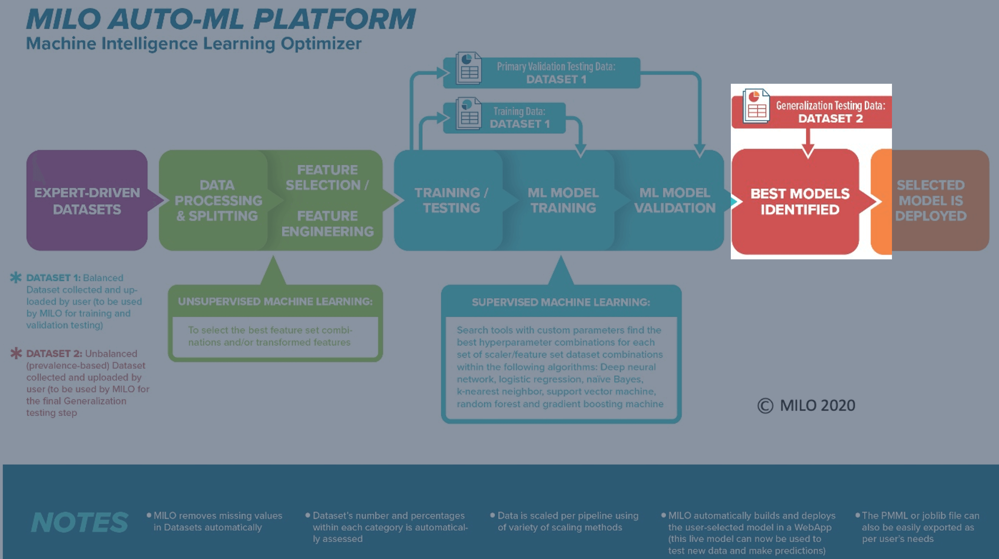

# Step 4: "Results"

This page allows one to visualize the model performances (based on their Generalization dataset assessment) and to fine-tune or deploy the models if needed. MILO-ML now supports both binary and multi-class classification results with enhanced visualization and analysis capabilities.

Once a run is completed, you will automatically be taken to this results page (see below). Here you can view all pipelines run and their statistical performance against your generalization dataset.

## Overview

In the image below you will see 3 graphs at the top and a table below them. The graphs represent details for the selected model (highlighted in grey) within the table. As you select new models, the graphs will update with their corresponding models and their associated performance measures.

For **multi-class models**, additional visualization options are available to analyze class-specific performance using One-vs-Rest (OvR) approaches.

## Classification Type Detection

MILO-ML automatically detects whether your problem is:
- **Binary Classification** (2 classes): Traditional binary metrics and visualizations
- **Multi-class Classification** (3+ classes): Enhanced metrics with macro-averaging and class-specific analysis

## Performance Metrics by Classification Type

### Binary Classification Metrics
- **Accuracy**: Overall prediction accuracy
- **Sensitivity (Recall)**: True positive rate
- **Specificity**: True negative rate
- **Precision (PPV)**: Positive predictive value
- **NPV**: Negative predictive value
- **ROC AUC**: Area under the ROC curve
- **F1 Score**: Harmonic mean of precision and recall

### Multi-class Classification Metrics
- **Overall Accuracy**: Correct predictions across all classes
- **Macro-averaged metrics**: Average performance across all classes
- **Per-class metrics**: Individual class performance using One-vs-Rest
- **Confusion Matrix**: Detailed class-by-class prediction accuracy
- **Class-specific ROC curves**: OvR ROC analysis for each class

## Class-Specific Analysis (Multi-class)

For multi-class models, you can access detailed class-specific results:

1. **Class Selection**: Choose specific classes for detailed One-vs-Rest analysis
2. **Individual Class Performance**: View ROC curves, precision-recall curves, and reliability plots for each class
3. **Comparative Analysis**: Compare performance across different classes

## Custom Class Labels

If you provided custom class labels during data upload, they will be displayed throughout the results:
- Table columns show meaningful class names instead of numbers
- Graphs and charts use your custom labels
- Export files include both numerical indices and custom labels

## Table options

The table itself is very flexible and offers many options. First, on the left-hand side, you will notice a star which allows you to mark models as favorites. You may also use the header bar star to toggle showing only favorites.

Next is the table filter which allows you to drill down on results in a variety of ways. Using the `All` drop down, you can filter on all aspects of a run whereas selecting specific options from the drop down ensure the filter only applies to that aspect of the model.

**New Multi-class Filters:**
- **Class Type**: Filter by binary vs multi-class models
- **Class Index**: For multi-class models, filter by specific class results
- **Performance Threshold**: Filter models by minimum performance criteria

You may also tap on any header element to sort the table using that field. The header button can be tapped again to change the sort from descending to ascending.

## Export results

Next to the graphs, you will see a save icon (highlighted with the red box in the image below) which allows you to export PNGs of all three graphs for the model that has been selected within the table (highlighted in grey within the table).

Additionally, there is an export button (highlighted with the red box in the image below) at the top header which allows a CSV export of the entire table of results for viewing in any spreadsheet editor (e.g., Excel). 

**Enhanced Export Options:**
- **Full Results**: Complete results including all classes
- **Class-Specific Results**: Export results for individual classes
- **Comparison Reports**: Side-by-side class performance analysis

:::tip
For details on the exported report, please refer to [Glossary for Report Column Definitions](./glossary-report-export.md)
:::

## Run details

In order to see details about the MILO-ML run (e.g., how many models were built and evaluated, how many pipelines and what combination was employed, etc.), you may select one of the two blue buttons located in the middle right side (between the table and the graphs). The first button, `Parameters` allows you to see which pipeline elements were selected during step 3 (i.e., Train step). The second button, `Details` (highlighted with the red box in the image below) gives you some basic information about the number of models built within each algorithm along with what was ingested within the MILO-ML run, as shown below.

**Enhanced Details for Multi-class:**
- **Class Distribution**: Shows the number of samples per class
- **OvR Model Count**: Number of One-vs-Rest models generated
- **Memory Management**: Resource usage during training

## Test model

Each row of a model will have a green play button indicating the ability to run the model for ad hoc testing. For multi-class models, testing supports:

- **Single Predictions**: Test individual cases and see class probabilities
- **Batch Predictions**: Upload a dataset for batch classification
- **Class Probability Display**: View probability scores for all classes

Please see the [Test model](./test-model.md) documentation for more detail.

## Threshold Tuning (Binary and OvR)

For binary classification and One-vs-Rest analysis of multi-class models, you can adjust decision thresholds:
- **Binary Models**: Adjust the standard 0.5 threshold
- **Multi-class OvR**: Tune thresholds for individual class-vs-rest decisions
- **Performance Impact**: See real-time updates to metrics as you adjust thresholds

## Publish model

Each row of a model will also have a blue upload button (highlighted by the red box in the image below) indicating the ability to fix and publish the model for current or future use without the need for new or additional training.

**Multi-class Publishing Features:**
- **Complete Model**: Publish the full multi-class model
- **Class-Specific Models**: Publish individual One-vs-Rest models
- **Custom Naming**: Use meaningful names reflecting your class structure

Once the model of interest is selected (grey highlighted row in the table as shown above), the blue cloud button can be clicked (as highlighted by the red box in the image above) to name and ultimately publish this model on your MILO-ML homepage. You will first be presented with a new window to name your model (no spaces allowed in naming the new model) and if desired, change the default decision threshold (leave empty to use the default value of .5) as shown below.

**Note for Multi-class Models**: Publishing a multi-class model makes the complete classifier available, with the ability to predict any of the trained classes.

Please see the [Publish model](./publish-model.md) documentation for more detail.

## Advanced Multi-class Features

### One-vs-Rest (OvR) Analysis Modes

MILO-ML provides two approaches for OvR analysis in multi-class problems:

#### Efficient Mode (Default)
- **Quick Analysis**: Uses the main multi-class model for OvR metrics
- **Resource Efficient**: Minimal additional computational cost
- **Consistent Methodology**: All classes analyzed using the same model framework
- **Use Case**: Initial exploration, resource-constrained environments, balanced datasets

#### Re-optimization Mode (`reoptimize_ovr=true`)
- **Dedicated Models**: Creates specialized binary classifiers for each class vs. all others
- **Enhanced Performance**: Each class gets individually optimized hyperparameters
- **Higher Accuracy**: Potentially better per-class performance through specialization
- **Use Case**: Production deployment, critical applications, imbalanced datasets

**Configuration**: Enable re-optimization mode in the training parameters for maximum per-class accuracy at the cost of increased training time and resources.

### OvR Analysis Features
Access detailed One-vs-Rest analysis for any class in your multi-class model:
- Individual ROC curves for each class vs. all others
- Class-specific precision-recall curves  
- Reliability calibration plots per class
- **Model-Specific Results**: View results from either efficient mode or re-optimized models
- **Performance Comparison**: Compare efficient vs. re-optimized performance when both are available

### Class Comparison Tools
- Side-by-side performance metrics
- Confusion matrix visualization
- Class imbalance analysis and recommendations
- **OvR Model Performance**: Compare individual OvR models when re-optimization is used
- **Resource Usage Reports**: Training time and memory usage for different modes

### Model Interpretation
- Feature importance per class
- Class-specific feature effects
- Decision boundary visualization (where applicable)
- **Model Selection Guidance**: Recommendations on when to use efficient vs. re-optimization mode

### Export Options for OvR Models
- **Individual Class Models**: Export specific OvR binary classifiers
- **Mode Selection**: Choose exports from efficient or re-optimized models
- **Performance Reports**: Detailed comparison between approaches
- **Deployment Packages**: Complete packages for production deployment

For detailed information about choosing between efficient and re-optimization modes, see the [One-vs-Rest Optimization Guide](./ovr-optimization-guide.md).