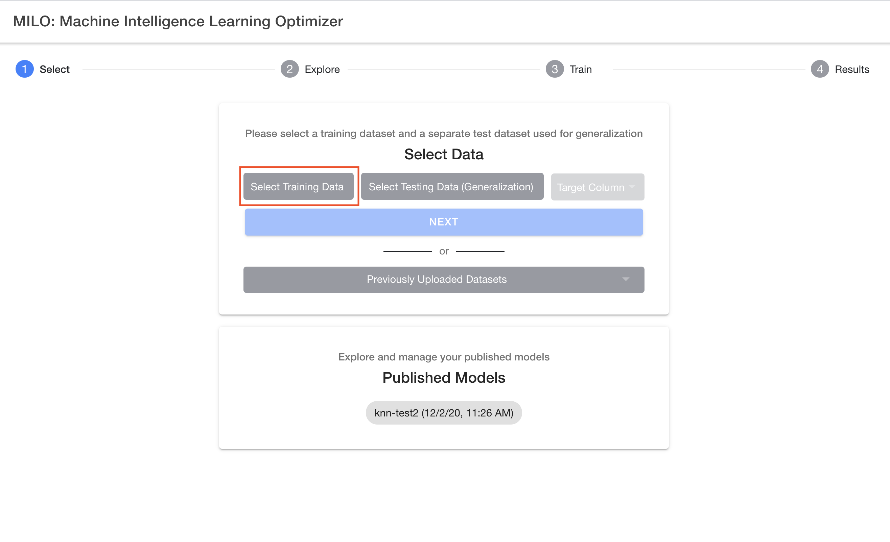
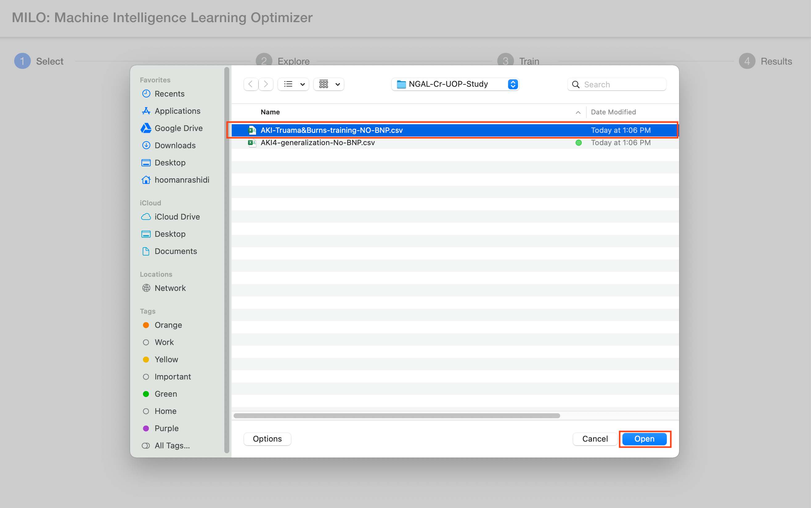
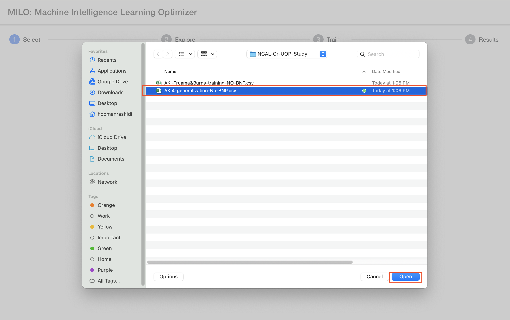
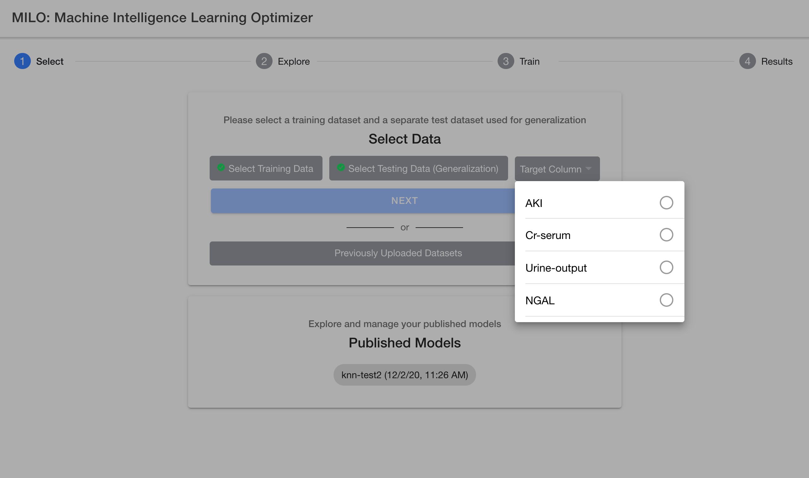
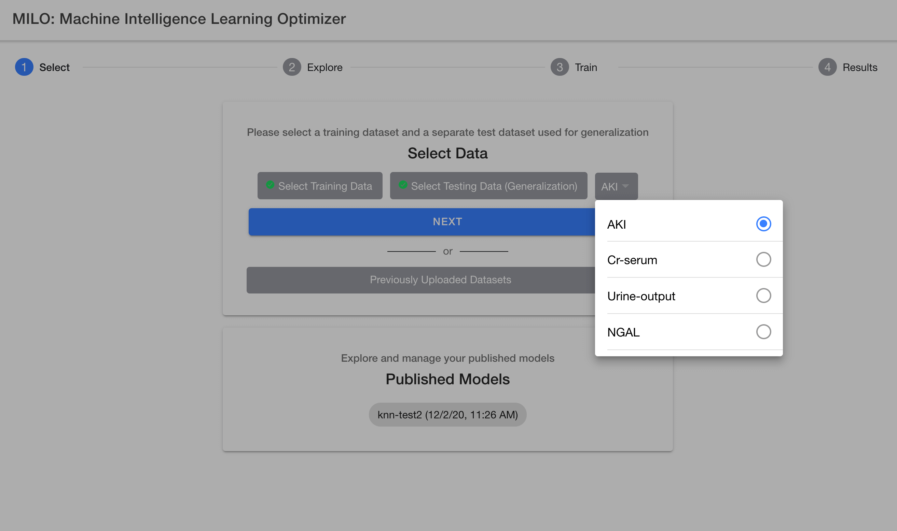
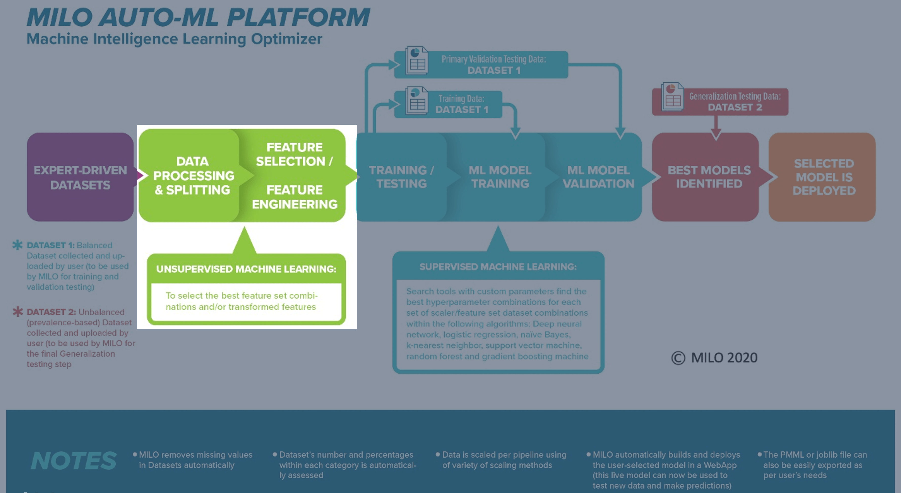

# Step 1: "Select" (Selecting & Uploading your datasets)

Now that you are ready to import your two compatible datasets in MILO-ML, the next several sections will take you step by step through MILO-ML's simple 4 step approach which ultimately will give rise to your ML model(s).

As noted earlier, first comes the "Select" step which allows you to easily upload your 2 required datasets followed by you picking your classification target of interest. **MILO-ML now supports both binary classification (e.g., "Cancer" vs "No Cancer") and multi-class classification (e.g., "Healthy" vs "Mild Disease" vs "Severe Disease")**. Hence, in this first step of the 4-step process, you select and upload the 2 required datasets, similar to what is being shown below within MILO-ML's "1-Select" page. If this is your first-time using MILO-ML, please use the provided sample datasets as you follow along the remainder of this guide.

After selecting your two csv datasets, you will then need to select your target column name which needs to contain numerical class labels. **The system automatically detects whether you have a binary or multi-class classification problem:**

## Binary Classification (2 classes)
- Target should contain exactly **0s and 1s**
- 0s represent negative cases (e.g., No Cancer)
- 1s represent positive cases (e.g., Cancer)

## Multi-class Classification (3+ classes)  
- Target should contain **0, 1, 2, 3...** representing each class
- Each number corresponds to a different category
- Example: 0=Healthy, 1=Mild Disease, 2=Moderate Disease, 3=Severe Disease

For more details on target definition, please see the "Defining the model target" section in the Dataset Preparation guide.

## Custom Class Labels (New Feature)

MILO-ML now supports custom class labels for better interpretability of your results:

### How to Add Custom Labels
1. **Upload your datasets** with numerical target values (0, 1, 2, etc.)
2. **Optionally provide custom labels** during the upload process
3. **Map meaningful names** to your numerical codes

### Examples of Custom Labels
- **Binary**: Instead of "0, 1" → "Healthy, Disease"
- **Multi-class Severity**: Instead of "0, 1, 2, 3" → "None, Mild, Moderate, Severe"  
- **Disease Types**: Instead of "0, 1, 2" → "Type A, Type B, Type C"
- **Risk Categories**: Instead of "0, 1, 2" → "Low Risk, Medium Risk, High Risk"

### Benefits of Custom Labels
- **Improved Readability**: Results tables and graphs show meaningful names
- **Better Communication**: Easier to share results with stakeholders
- **Reduced Errors**: Less confusion about what each class represents
- **Professional Reports**: Exports include both numerical codes and descriptive labels

## Enhanced Validation for Multi-class

MILO-ML performs enhanced validation for multi-class datasets:

### Automatic Checks
- **Class Count Validation**: Ensures minimum 2 classes (binary) or 3+ classes (multi-class)
- **Class Balance Assessment**: Analyzes distribution across classes
- **Sample Size Validation**: Verifies adequate samples per class (minimum 25 per class)
- **Missing Class Detection**: Identifies any gaps in class sequences

### Quality Warnings
- **Imbalanced Classes**: Alerts when some classes have very few samples
- **Missing Intermediate Classes**: Warns if you have classes 0, 1, 3 but no class 2
- **Insufficient Data**: Notifies if any class has too few samples for reliable modeling

## Select previously uploaded dataset

The previous section was focused on how to upload your "new" datasets (not previously uploaded in MILO-ML) within the platform. This section specifically deals with previously uploaded datasets within MILO-ML. If you have previously uploaded a dataset, you do not need to upload it again for additional searches. You may select these prior uploaded datasets by clicking the "Previously Uploaded Datasets" button on the MILO-ML homepage as shown in the image below.

After clicking the "Previously Uploaded Datasets" button (located under the "Next" button), you will be presented with a window to select the prior dataset of your choosing (see image below).

**Enhanced for Multi-class**: Previously uploaded datasets now display additional information including:
- **Classification Type**: Shows whether the dataset is binary or multi-class
- **Number of Classes**: Displays the total number of classes in the dataset
- **Class Labels**: Shows custom labels if they were provided
- **Class Distribution**: Brief summary of class balance

Now that you have uploaded the two required datasets within MILO-ML and have selected the appropriate target, you are now ready to click the "Next" button and move to the "2-Explore" page which allows you to get a better sense of what has been ingested into MILO-ML before any of the ML steps have been initiated.

## Evaluation of data completeness

When exporting data in bulk, often times you will find gaps for some rows in various columns and those values may be represented in various ways. Gaps can be blank, NaN, Null, or other representations. Notably, MILO-ML will remove such rows which do not contain 100% of the column's numerical data. The number of rows removed versus used will be visible after uploading the dataset and discussed in a later chapter. 

**Multi-class Considerations**: For multi-class problems, it's especially important to ensure that all classes maintain adequate representation after removing incomplete rows. The system will:
- **Monitor class distribution** during data cleaning
- **Warn if any class** becomes under-represented
- **Suggest alternative approaches** if too much data is lost

Obviously, for datasets with increased number of missing data, MILO-ML's removal of the rows with missing data could sometimes markedly limit the final number of usable data within MILO-ML. This can sometimes alter the results in light of the much smaller dataset created and used within MILO-ML. To minimize the number of rows (i.e., cases) removed by MILO-ML's automated approach, we recommend the user to first self-evaluate the datasets to minimize the removal of such rows/cases. This can sometimes be easily achieved by removing certain columns (instead of rows) that appear to be missing a great deal of the data. Hence, removal of such columns (when deemed appropriate by the user) can markedly minimize the removal of rows/cases by MILO-ML and allow for a greater number of cases to be evaluated by MILO-ML's automated platform with minimal impact on the final dataset size.

**Multi-class Specific Recommendations**:
- **Maintain Class Balance**: Be extra careful when removing columns to ensure all classes remain adequately represented
- **Class-Specific Missing Data Analysis**: Check if missing data patterns differ across classes
- **Stratified Data Cleaning**: Consider class-aware approaches to data cleaning when possible

::: warning
Some datasets may have other invalid values such as numerical representations (e.g. -1 instead of appropriate class codes) and these cases will not be removed by MILO-ML and must be handled prior to upload. For multi-class problems, ensure that:
- **Class codes are sequential**: Use 0, 1, 2, 3... without gaps
- **No invalid class codes**: Avoid negative numbers or codes outside your expected range  
- **Consistent encoding**: Ensure the same class is always represented by the same number across all datasets
:::

## Advanced Multi-class Features

### Class Imbalance Handling
- **Detection**: Automatic identification of class imbalance issues
- **Recommendations**: Suggestions for handling imbalanced datasets
- **Stratification**: Options for stratified sampling during train/test splits

### Class Validation
- **Consistency Checks**: Ensures training and generalization datasets have the same classes
- **Missing Class Detection**: Identifies if test data contains classes not seen in training
- **Class Frequency Analysis**: Reports the distribution of each class

### Dataset Summary for Multi-class
After upload, you'll see enhanced summary information:
- **Total Classes**: Number of unique classes detected
- **Class Distribution**: Percentage breakdown of each class
- **Balance Assessment**: Indication of whether classes are balanced
- **Sample Sufficiency**: Whether each class has adequate samples for modeling