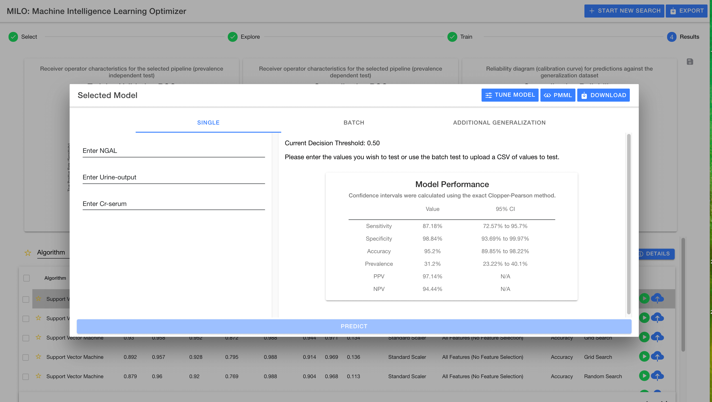
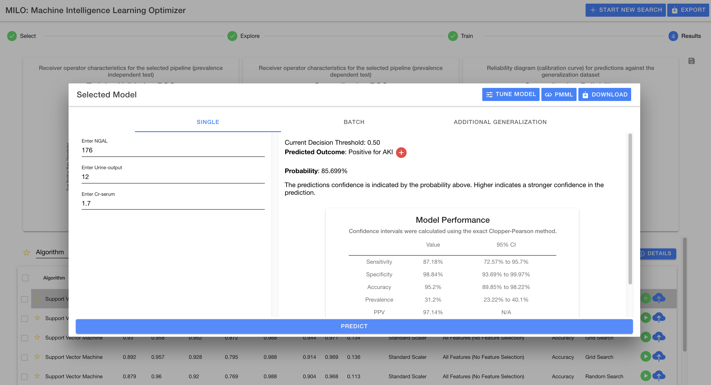
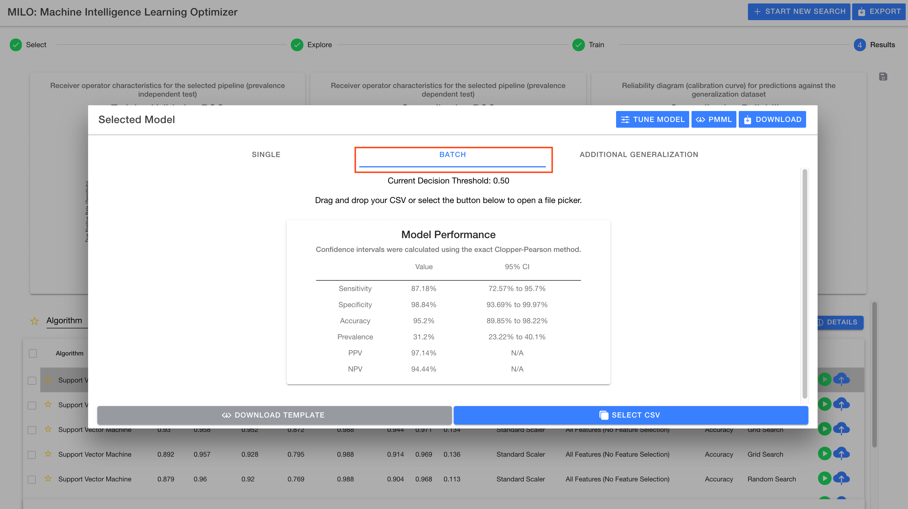
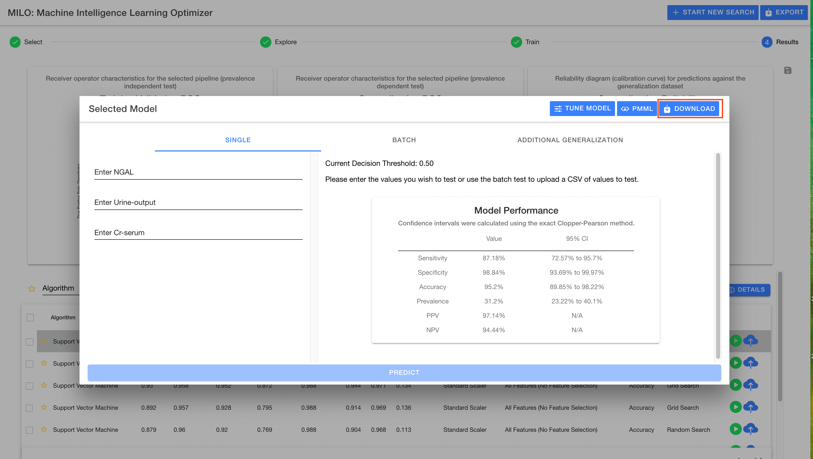

# Test model

Testing a model allows you to provide additional input data and get a prediction from the selected model.

Data can be input ad hoc using the `Single` entry fields allowing a prediction to be calculated on the entered data. The result will be displayed in the window on the right upper hand side along with a graphic displaying the prediction result (i.e., positive or negative). Once a prediction is made, the right hand side will not only show the predicted outcome but also the probability of this outcome (as shown in the images below).

## Decision Threshold

Every model defaults to the standard 0.5 decision threshold meaning if the probability for an outcome is below 50% then the prediction is negative versus 50% or greater is marked as positive.

The decision threshold can be adjusted between a range of 0.3 to 0.7 within the MILO-ML platform as a way to fine tune the model if needed to further enhance its prediction performance. The new decision threshold ultimately allows a potentially modified outcome (i.e. predictions) that reflect the model’s new settings and capabilities.

The `Tune Model` button allows you to adjust model characteristics including the decision threshold, as shown in the images below:

## Batch entry

Additionally, you may provide a dataset to use for more detailed group testing through MILO-ML’s `Batch` mode (this dataset should have similar features as the ones that were used to build the models). This allows the model to predict on every row of the data and adds a new column at the end which contains the target column (the new prediction). An additional column is also added to show the probability of each of these outcomes.

## Additional Generalization

Lastly, you may pass a new dataset with similar features to the generalization data set that was uploaded in Step 1 "Select" page and have the model performance be re-calculated for the provided new dataset. The result will be shown in the window replacing the previous performance.

## Download joblib

You may also export a pickled (fixed) version of the model which can be used in Python applications to directly restore the model into memory. To download the pickled model, simply use the `Download` button in the header of the modal (as highlighted below).

