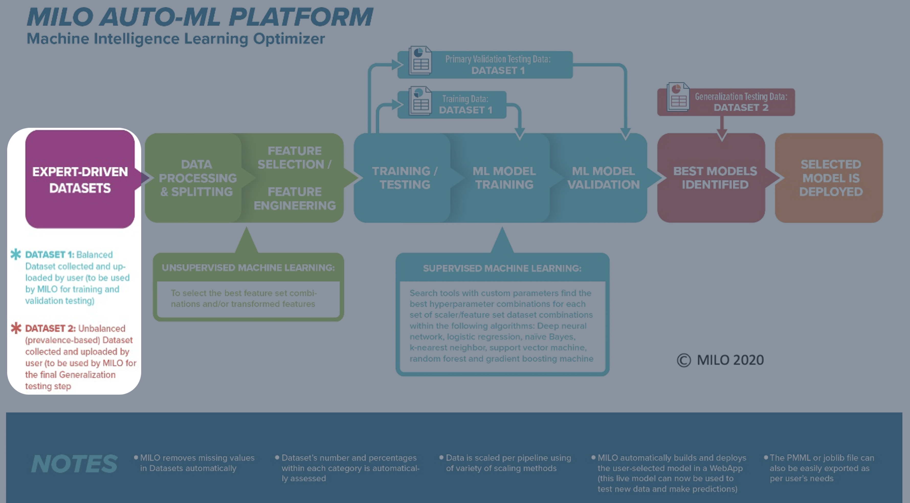
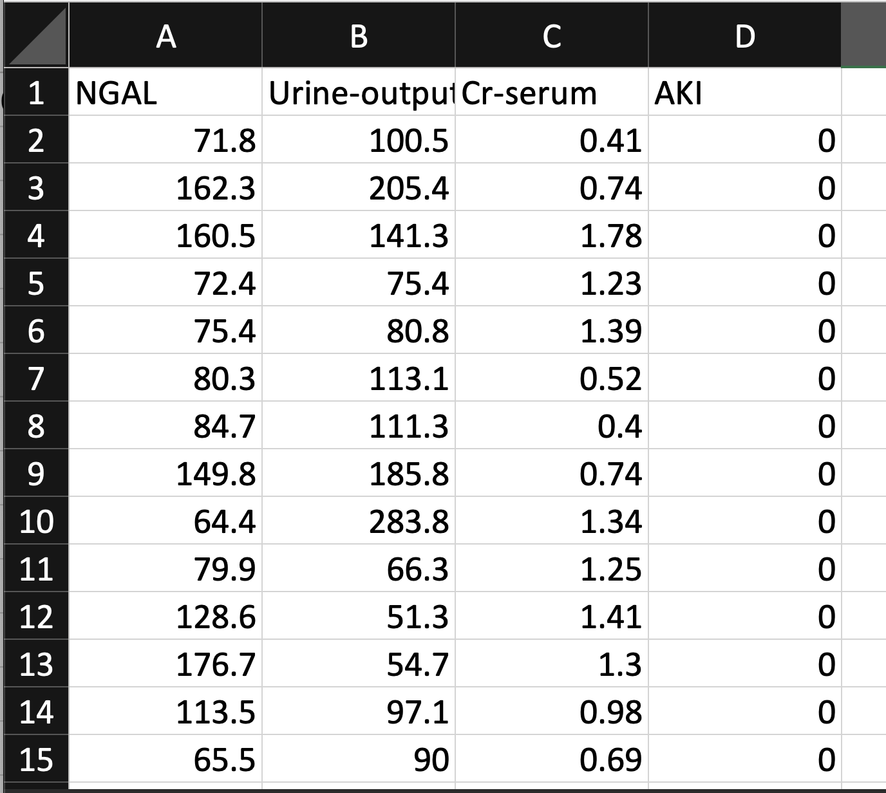
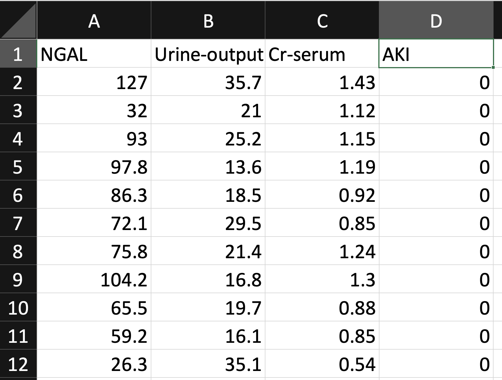

# Dataset Preparation

Data can come in all types, shapes and sizes (numbers, images, texts), however in order for your data to be used within MILO, it needs to be first structured in a specific way so that it is compatible with MILO.

The data "type" compatible within MILO needs to be in the form of a numerical dataset (non-image and non-text). If the dataset includes text (e.g., Yes vs No or Male vs Female, etc.), that text will first need to be converted into a numerical value so that it is MILO-compatible (e.g., 1 for Yes vs 0 for No or 1 for Male vs 0 for Female, etc.).

The data "shape" compatible within MILO is also very important and needs to be in the form of a csv file (note: these can be easily made within one's Excel dataset file by saving the single Excel sheet as a csv file). The final csv file will need to include a set of features (i.e., variables) and a single binary target (i.e., 0s and 1s as the negative versus positive target, respectively) to map the features to the binary target class [as you recall, MILO is an optimized binary classification (e.g., Cancer versus No-Cancer) Auto-ML software]. Another example (besides the cancer sample datasets that has been provided) of a MILO-compatible data (e.g.,  Acute kidney Injury (AKI) dataset) is shown below with its features being represented in the columns "NGAL", "Urine-output", and "Cr-serum" while its target column representing the cases that are AKI positive (i.e., 1) versus AKI negative (i.e., 0). Although the AKI datasets are not being provided for your use, the Cancer sample datasets provided here will follow the same rules and formatting guidelines that are shown below within the AKI dataset. This way you will get a better appreciation of both of these datasets at the same time which will hopefully give you a better understanding of the overall data-type and structural compatibilities for your own datasets that you will ultimately use within MILO.  

In summary, regardless of the study, the following 3 things are required of the datasets for getting started in MILO:

1. Two csv datasets (numerical-based ) are required

    - The first dataset (known as "Training dataset") is for training/initial validation (i.e., MILO will automatically take this dataset and do an 80-20 split with cross validation. This means 80% of the Training dataset is used for training/building the models and 20% withheld for the initial test validation while being cross validated 10 times for statistical integrity within MILO’s model building phase).
    - The second dataset (known as "Generalization dataset") is solely used for the generalization/secondary testing of all the models that were generated from the aforementioned build phase of MILO from the "Training dataset"  noted above. This second dataset should preferably also represent the true prevalence of the target (e.g., disease state, etc.) that is being tested on those models to better represent the model’s true performance.

Examples of such datasets are shown in the figures below.

In an optimal setting, the first dataset should be a retrospective dataset while the second dataset should preferably represent the follow up prospective dataset for that study. However, in real life this may not always be available, and one may need to heuristically build the 2 datasets required from a single retrospective dataset as an initial proof of concept study.

::: tip
Note: The models generated from these pilot studies should then be further validated on additional tertiary and quaternary independent prospective datasets before they can be even considered for deployment or considered being used as a predictive analytics tool.
:::

1. A binary target column is required

- In each dataset, generally the last column represents the desired binary target within MILO. Since MILO is a binary classification Auto-ML platform, the target needs to be in the form of 1s and 0s which represents the positive and negative cases in a given dataset, respectively.
- In the sample cancer datasets provided, Cancer status serves as the target (i.e., Cancer versus No-Cancer cases). The positive cases (Cancer) are depicted as 1s while the negative Cancer cases are assigned as 0s.
- In the example shown in the image below, Acute Kidney Injury (AKI) status was used as the target (i.e., AKI versus No-AKI cases). The positive cases (AKI) are depicted as 1s (not shown in the image below) while the negative cases of AKI (i.e., No-AKI) are assigned as 0s (as shown in the image below).

1. A set of "features/variables" columns are required

To build/train each ML model within MILO, both datasets (the first/training and second/generalization testing datasets mentioned above) must also include a set of features (AKA variables or attributes) which will need to be identical and in the same column order within both datasets. Examples of features/variables within the AKI dataset (shown below) are the Urine output, Cr-serum and NGAL columns. These features/variables are then mapped to each target class (AKI versus No-AKI) to ultimately build the final ML model within MILO’s platform which will then be able to predict the presence or absence of AKI on future unknown cases based on their unique feature characteristics (e.g., the optimized ML model will then be able to import new Urine output, Cr-serum and NGAL values to predict the AKI status). In summary, the MILO- generated ML model learns from the past data to ultimately be able to predict the future outcome on new data. In other words, the ML model is learning from the past feature set /target combinations (represented by the retrospective data) to become an ML model that can make future predictions on unknown datasets with similar feature sets.

Please note: the training dataset should preferably be balanced between negative and positive cases of your binary classifier (i.e., target column) while the generalization dataset should be more reflective of the target’s true prevalence.

Also, as mentioned above, one of MILO's strengths is its generalization step which allows each model created and validated in the first building/initial validation step to be secondarily tested with a separate generalization dataset within MILO before becoming available for use. This approach ultimately helps to minimize overfitted models which is one of the most common pitfalls within the ML model building world. Additionally, when dealing with small to intermediate-sized (100s to low 1000s) datasets the overfitting phenomena becomes more pronounced and further demands the need for separate secondary and tertiary generalization test sets. This is because the second (generalization) dataset is not used during the training phase whereas the first (training) dataset is split internally into a train/test split (as noted earlier) and may have become influenced by its own data, further reinforcing the absolute need for the second separate generalization dataset in this process.

## Types of compatible data

As mentioned earlier, MILO uses numerical data only and therefore is not compatible with images, audio, video, graphic, textual or other non-numeric data formats. In some instances, invalid formats can be converted into a numeric representation allowing MILO to function properly. For example, if you have textual data such as "Low", "Medium", and "High" then you could encode these into 1, 2 and 3 respectively (if appropriate).

Additionally, your data might be spread across several databases or spreadsheets and will need to be joined or flattened into a single table since that is what’s needed to generate the MILO-compatible csv file. The result will look something similar to the below spreadsheet:

::: tip
Notice the first row contains the column headers in which the first 3 columns represent the features/variables and the last column (i.e., AKI) represents the target in this dataset (note: only the No-AKI cases represented as 0s are shown in the image above and the positive AKI cases, although present in the csv file and represented as 1s, are not shown in the image).
:::

## Defining the model target

As noted above, once you have gathered your data, you need to select the labeled column that represents your binary target for your model. MILO only allows for binary classification-based models, meaning everything under the target is valued at either 0 or 1 representing states like negative versus positive, not-present versus present, low risk versus high risk, etc. In the case depicted below, AKI is the target and the 0s noted below the AKI target column represent the No-AKI cases for this dataset. Note: the positive AKI cases (not shown below) would be represented as 1s within the csv file.

Note: If you are concurrently evaluating the sample Cancer dataset (which is provided for your convenience), you will notice the last column (i.e., target column) in those csv dataset files are labeled as "Cancer", with the positive cases listed as 1s and the negative cases listed as 0s.

Now that your two required datasets are prepared for a given binary classification problem, you can begin uploading the data into MILO. The next several sections within this guide will walk you through MILO’s aforementioned 4 steps which will ultimately give rise to the ML model of your interest.

If this is your first-time using MILO, we recommend using the sample Cancer dataset (that is provided to you here) for your first MILO test run. Also, for this first test run, we recommend starting with a smaller number of faster algorithms (i.e., Logistic regression and Support vector machine algorithms selected within MILO) so that the build phase can be completed in a much faster pace. This way you can get introduced to the various MILO capabilities in a much more efficient manner and without a hiccup as you go through this guide while getting to know the various analytics tools that MILO can offer during and after each run.

Note: For your future real MILO runs (on your own datasets) we recommend running all algorithms and permutations within MILO to optimize your chance of finding the best performing ML model for your given study. However, those full runs take a while to complete so for the sake of this tutorial, it is best to test with a limited number of simpler algorithms (e.g., Logistic regression and Support vector machine) as noted earlier.

Now that you are familiar with what is required to become a MILO-compatible dataset, let’s start going through MILO.
