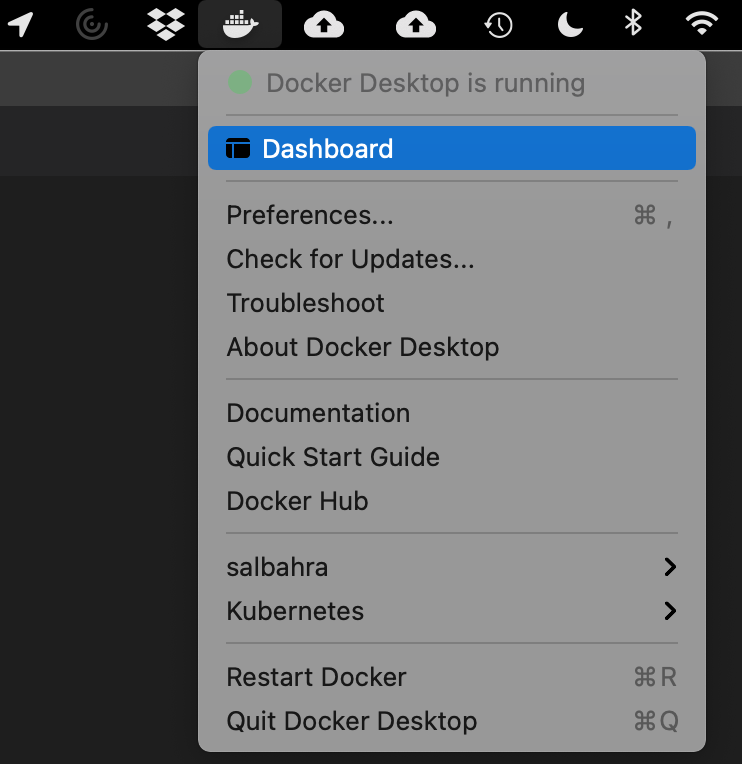
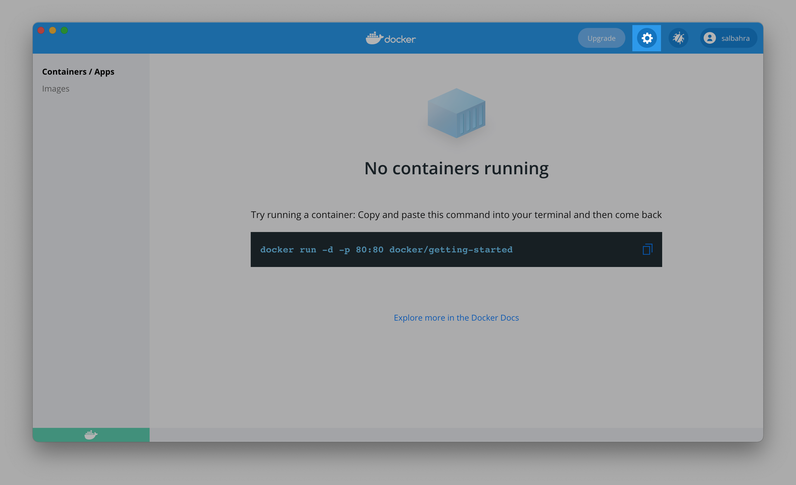
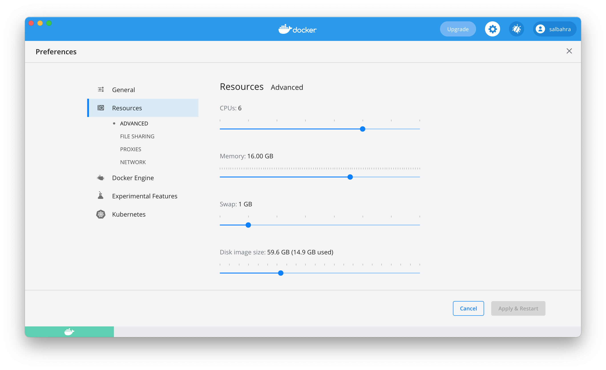
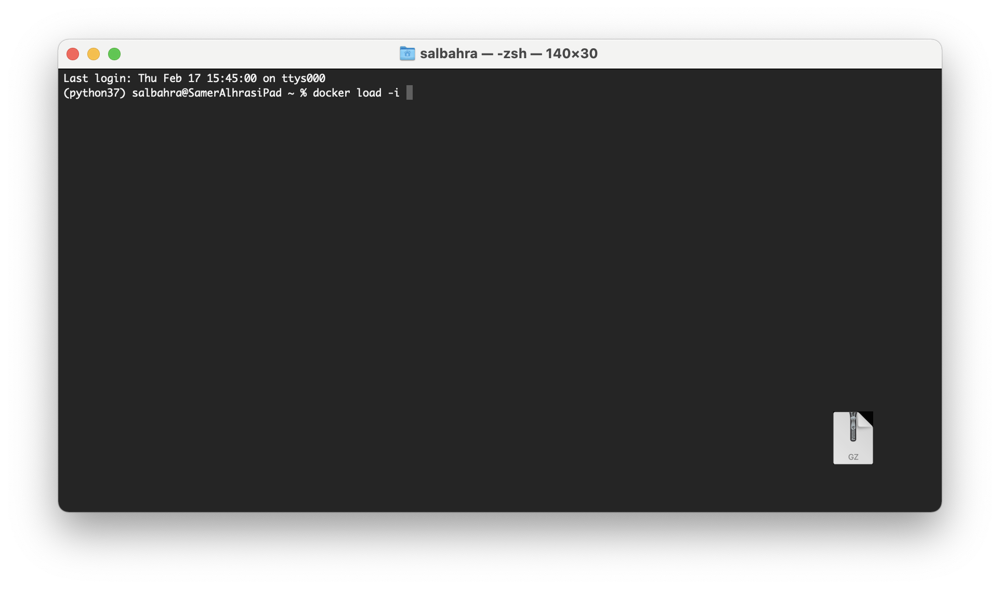
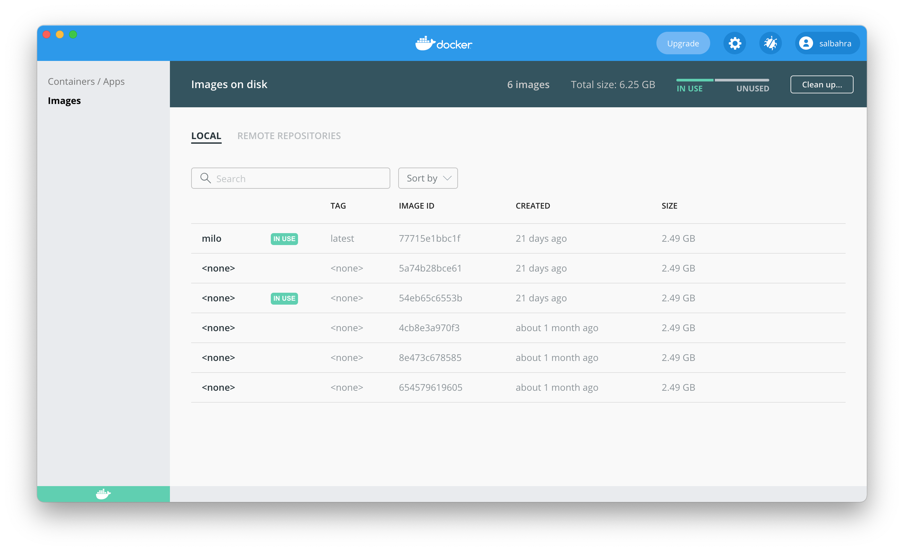
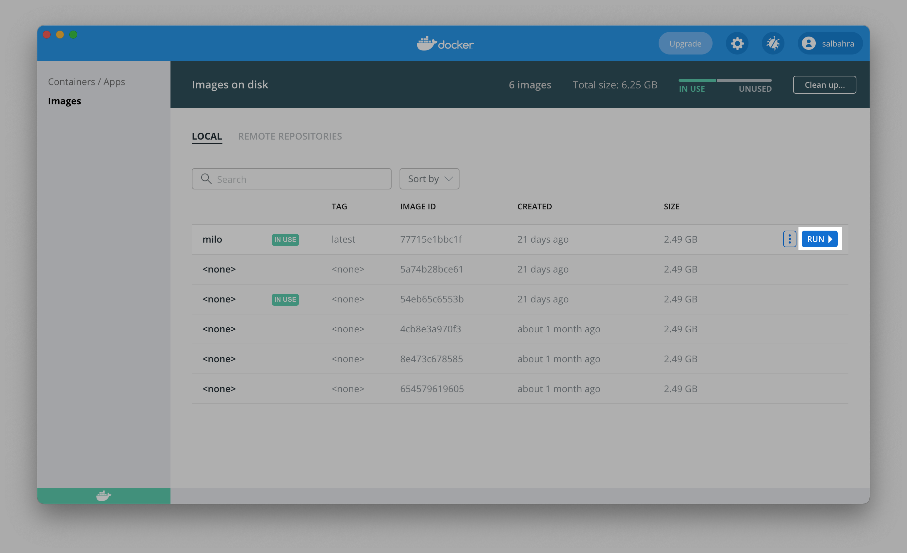
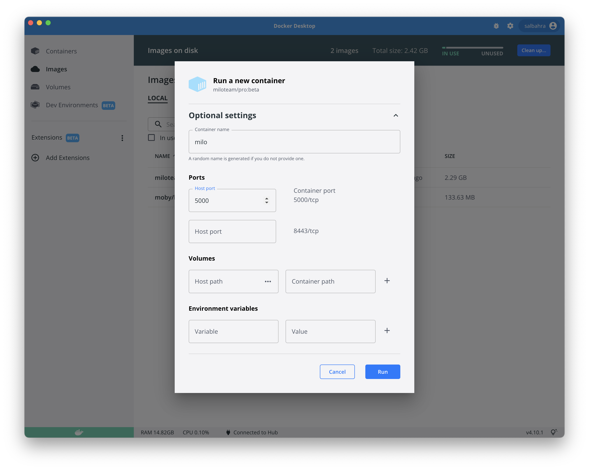
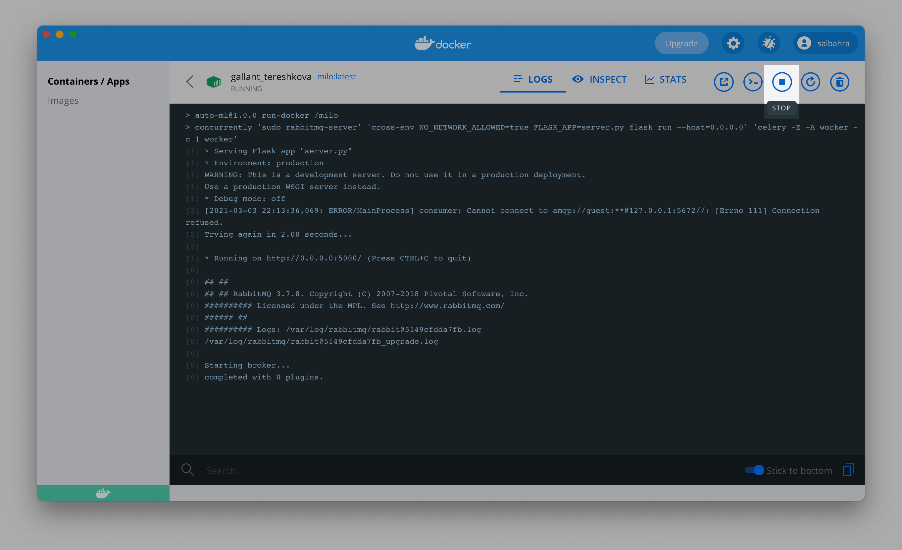

# Docker

MILO-ML's docker image hosts everything needed to get up and running with MILO-ML.

## 1) Install Docker Desktop

Download [Docker Desktop](https://www.docker.com/products/docker-desktop) and follow the instructions from the installer to get it installed on your system.

## 2) Open Docker Dashboard and Configuring Docker

This is a one time step after installing Docker to ensure enough resources are allocated for MILO-ML. This is done using the Docker Desktop Dashboard launched as shown here:



Inside the dashboard click the button with a gear icon as shown:



This will navigate to a settings page which has sections on the left hand side. Please navigate to the `Resources` section as shown below:



Here, please adjust the settings to maximize the available CPU and memory to meet at least 4 CPUs and at least 8GB of RAM.

## 3) Download MILO-ML Image

Please contact us to get a download link to our docker image. The file downloaded by the link provided will be a GZip file which should not be extracted.

## 4) Import MILO-ML Image

Docker Desktop does not currently provide a way to import an image but fortunately also installs Docker CLI. In this section, we will use Docker CLI
to import the MILO-ML docker image.

Please open any terminal and run the following command:

:::tip
For Windows users, you can search for `Command Prompt` in the search menu.

For macOS users, you can search Spotlight for `Terminal`.
:::

```sh
# Replace the file name with the one you downloaded

docker load -i milo-1.0.0.tar.gz
```

::: tip
You can drag and drop the file onto the terminal window to auto-populate the full file path. Start by typing `docker load -i ` (including the space at the end) and end by dragging the file onto the terminal window.


:::

## 5) First Time Starting MILO-ML

Once the MILO-ML image is loaded, the remainder of the deployment can be performed within Docker Desktop.

To start this image first open the Docker Desktop Dashboard and navigate to the `Images` section:



You will see an image name prefixed with `milo/` and will end with the version of MILO loaded (e.g., education, pro, or trial). If you hover over this two buttons will appear one of which is labeled `Run` as shown here:



After clicking this button you will be presented with a modal with some optional settings. Please expand this section
and configure it as shown in the image below:



The port 5000 is HTTP application port and is being forwarded to the host machine's port 5000 in the above image. The data
directory is where MILO-ML places input data and results and can be mapped to the local machine for consistency between runs.

::: warning
License keys are associated to the hardware and therefore will become invalidated as the hardware changes. Keep in mind, each time
the `Run` button is clicked Docker creates new virtual hardware.
:::

::: warning
macOS added an Airplay Receiver service which listens on port 5000 and must either be disabled or we suggest using another port (e.g., 5001).
:::

Additional configuration options are available under the [Advanced Configuration](#advanced-configuration)

## 6) Start Using MILO-ML

After you start MILO-ML, you should see some output similar to the following:


This informs you that MILO-ML is ready to start processing requests and you can now launch your browser and navigating
to the following URL: <http://127.0.0.1:5000>.

## Stopping MILO-ML

You can always stop and re-start MILO-ML using the Dashboard by clicking the `Stop` button as shown below:



::: warning
Stopping MILO-ML will interrupt any training currently in progress so ensure no tasks are pending before stopping.
:::

Once stopped, the button will change to a play button allowing you to start MILO-ML again.

## Advanced Configuration

::: warning
Generally speaking, these values should not be used unless directed.
:::

In addition to the host port, several other options can be configured.

MILO will store data within the Docker container however
users may wish to store the data (uploaded datasets, run data, published models, etc.) outside of the container
and may do so by mounting a volume. The `Host Path` refers to the location on the machine running Docker and the `Container Path`
will always be: `/milo/data`. Additionally, SSL certificates are stored within `/milo/ssl` and can be mounted to replace the default
self-signed certificate.

In addition, MILO will typically run in a single user mode meaning no authentication is done as the interface is only expected to
be accessed via the localhost adapter. If you intend to run MILO to multiple users, you will want to disable the single user configuration
by defining an environment variable `LOCAL_USER` and setting the value to `false`.

If MILO is to deployed in an enterprise environment, authentication can be configured using LDAP. The following environment variables are
available for configuration in such an environment:

`LDAP_AUTH`: Either `true` or `false` (default)

`LDAP_SERVER`: The complete path to the LDAP server including the protocol (`ldap` or `ldaps`) and port number.

`LDAP_BASE_DN`: Defines the base distinguished name used to search for users.

`LDAP_AUTH_SECRET`: After successfully authenticating using LDAP, sessions are authenticated using a signed JWT token and this defines
the secret for that token.

`LDAP_REQUIRED_GROUP`: Ensure the user is a member of the group provided. Only checked if a group is defined otherwise no group checking is performed.

`BROKER_URL`: URL to the RabbitMQ broker (do not use when using the all-in-one image).
