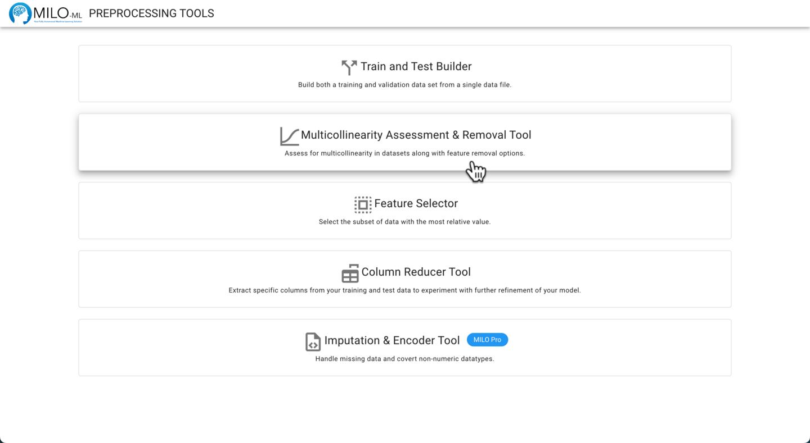

# Pre- and Post-Processing Tools

MILO provides a set of pre and post processing tools which allows users to more easily prepare and optimize
their data for use within the MILO Auto-ML tool. These can be accessed from the MILO landing page (under Preprocessing Tools).

The tools include:

- **Train and Test Builder**: Converting a single data file to the necessary two datasets (training / initial
validation test and generalization test datasets when needed) that is required within the MILO AutoML tool.

- **Multicollinearity Assessment & Removal Tool**: Allows you to observe and assess the correlations between
the variables and to remove high correlates when deemed appropriate.

- **Feature Selector**: As the name implies, this tool will allow you to assess and select the statistical
contributions of the independent variables to the target/outcome variable through two different methods
(an ANOVA F value approach and the Random Forest Importances method). This will allow you to visualize
and select for the most significant features within your dataset when necessary.

- **Column Reducer Tool**: Removes specific user-defined columns/features when needed.
