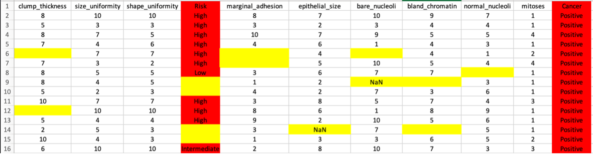
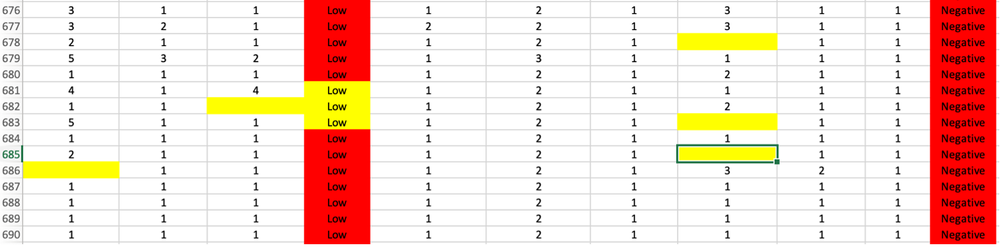
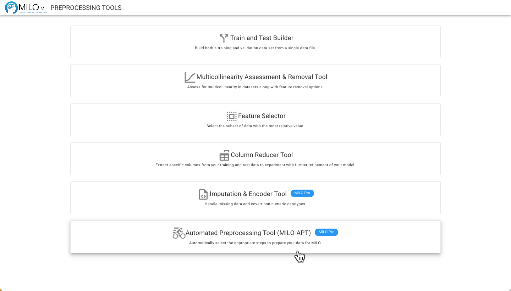
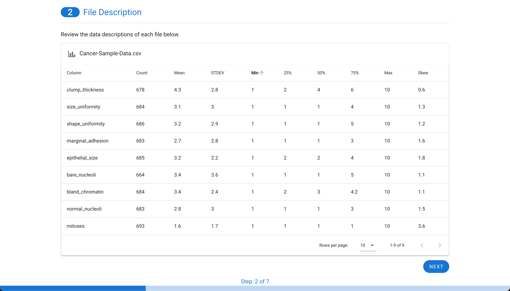
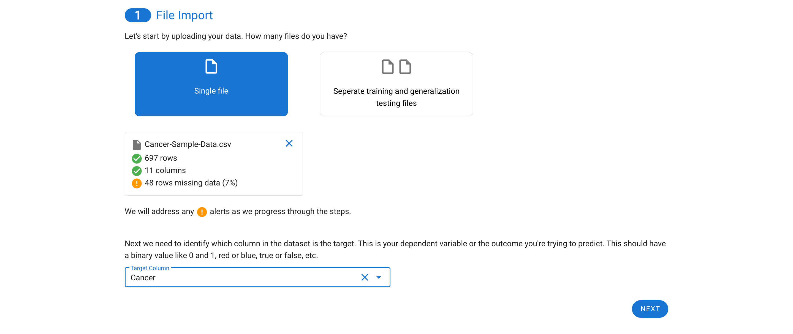
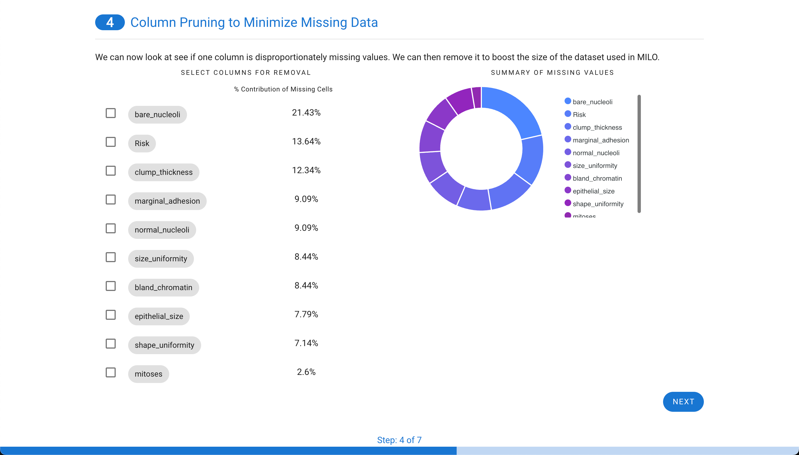
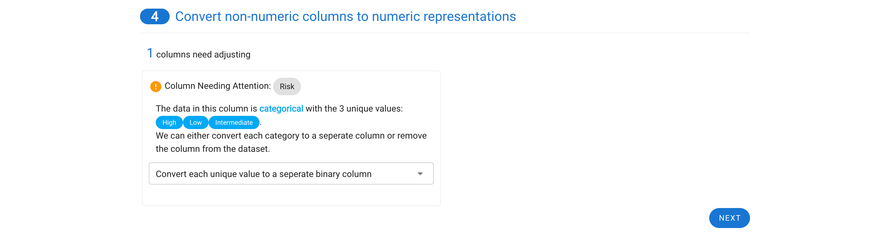
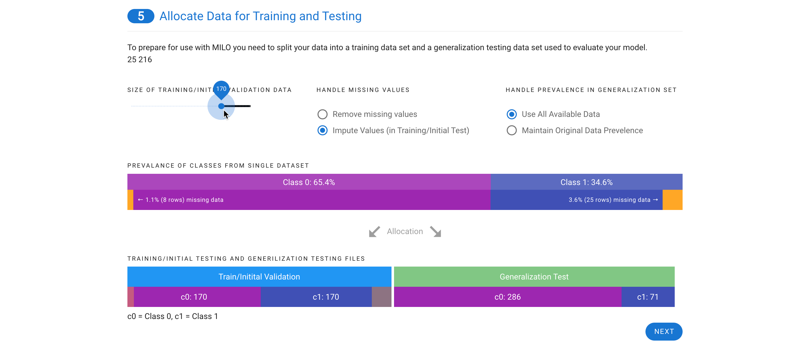
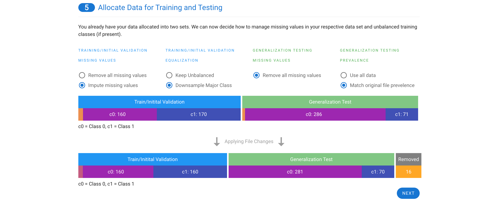
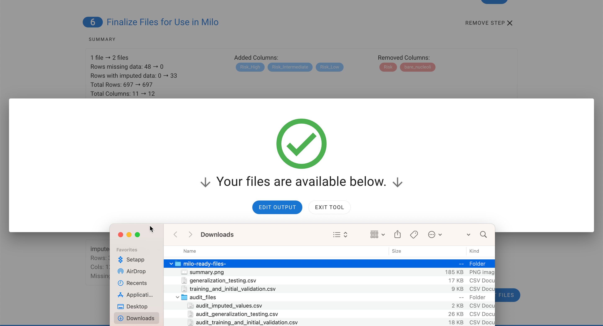

# Automated Preprocessing Tool  MILO Pro

A unique and powerful data preprocessing tool that dramatically streamlines the key steps in your Pre-Machine Learning dataset preparation pipeline by combining all our individual preprocessing Apps along with some powerful new functionalities.

* The tool allows you to work with either a single or multiple datasets (i.e. an already segmented pair of training/initial validation and generalization testing data sets)
*  The tool allows you to encode (i.e. replace) non-numerical columns (e.g. Text) to numeric representations as well as detect when a numerical column has a few abnormal non-numerical values needing removal.
*  The tool allows you to segment the data into the necessary training/initial validation and generalization testing data sets, 
*  The tool enables you to iteratively Impute (i.e. replace through inference) the missing values (through our integrated powerful imputation tool) or remove the rows with missing values, depending on your methodology and study needs.
*  The tool also enables you to assess the multicollinearity of the dataset features and remove highly correlated columns (i.e. features) when needed. 

The example below (a sample cancer csv file) shows a dataset in need of multiple preprocessing (i.e. cleaning) tasks. The multiple missing and NaN values (highlighted in yellow) will need to be either imputed or removed and the non-numerical values (i.e. text that are highlighted in red) will need to be converted to appropriate numerical counterparts. Additionally, the features with high correlations (multicollinearity) will potentially need to be removed. MILO Pro’s APT is able to address all these data cleaning tasks in a very intuitive and powerful seamless process. 

Navigate to the **Preprocessing Tools** from the MILO home page and then select the **Automated Preprocessing Tool**.
 

Start by selecting a single data file or upload your already combined training/initial validation and generalization testing data sets. If you upload two data sets, you will be asked to pick which data file corresponds to which of the two types of datasets. 

The target (or outcome) must also be specified. Remember, for binary classification this must be binary outcome such as true and false, 0 and 1, and A and B. 

 

Next, the file(s) will be assessed for having a valid target with a binary outcome (two unique values as seen here such as positive and negative which are assigned as 0 and 1, respectively). The tool also will provide the option to decide how the binary target (outcome) values are encoded into a representation of “0” and “1”. This is most useful for ambiguous items like “green” vs. “blue” etc. The tool will also check to ensure if two files are used, that the columns match between the files. The final check is to ensure there is enough data to be used within MILO. This requires that there are at least 50 rows for each of the two classes and that at least 25 of those rows have complete data. This ensures there is enough data to segment the training/initial validation and generalization testing files later (i.e. the minimum required to feed into MILO’s Auto-ML later on to build the ML models of interest).

Next, if missing values are present in the data, each column is assessed to evaluate the contribution. Sometimes, a single column is particularly sparse with data and is best to remove from the data set. In this example, only 48 rows are missing data from about 700 cases (as shown in step 1). Although, these can be removed in real life, in this case for demonstration purpose, these are later on imputed to highlight this tool within APT. Additionally, in this case one of the features (i.e. “bare_nucleoli”) was resposible for 21% of the missing values so this feature was selected for removal which decreased the number of rows with missing values to 33 (as shown in step 3).

Now the real power of the tool starts. MILO can only use numerical representations of the data. Categorical values or columns with a few non-numerical values cannot be used and will automatically be transformed. Each row needing processing is highlighted with a default choice made for you. In the example below, a categorical column is one-hot encoded into three columns with binary representations (which better represents the initial feature values as shown in step 4).

The next step depends on if you have a single file or two files.

**If you have a single file**, you will be given the choice on how to split your data into a training/initial validation file and a generalization testing file. Missing values can either be removed or imputed. Imputed values can only be included in the training/initial validation file and based on the settings you choose, we will recalculate and adjust the possible distribution of cases between the two files (as shown in step 5). The minimum size for any class within a file is 25. You can also decide how to determine the prevalence in the generalize testing file. You can either use all available data or match the prevalence of the original file.

**If you have two files**, the training/initial validation file can either have missing values removed or imputed. If the two classes are not even, you will also have the option to remove some rows of the majority class to equalize the prevalence of the two classes in the training file. For the generalization testing file, any missing values must be removed and, like the single file option above, you can either use all data or match the prevalence of the original file.

You now have a few choices. You can either export your files or run a multicollinearity assessment on the features and remove any correlated columns (i.e. features) before generating your final files. For details on this step, see the [Multicollinearity Assessment & Removal Tool](./multicollinearity.md) documentation.

Once selecting **Export Files**, you will see a summary of all the changes (see step 6) that were made and the files will be downloaded into a zip file.

 

The zip file contains training_and_initial_validation.csv file, generalization_testing.csv, and summary.png which is a snapshot of the final step summary. An audit folder is also included which maps the original files and rows (corresponding separate files display the details on any removed rows or imputed rows for closer evaluation).

