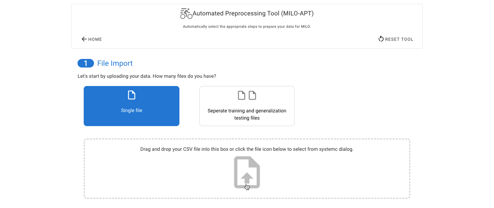
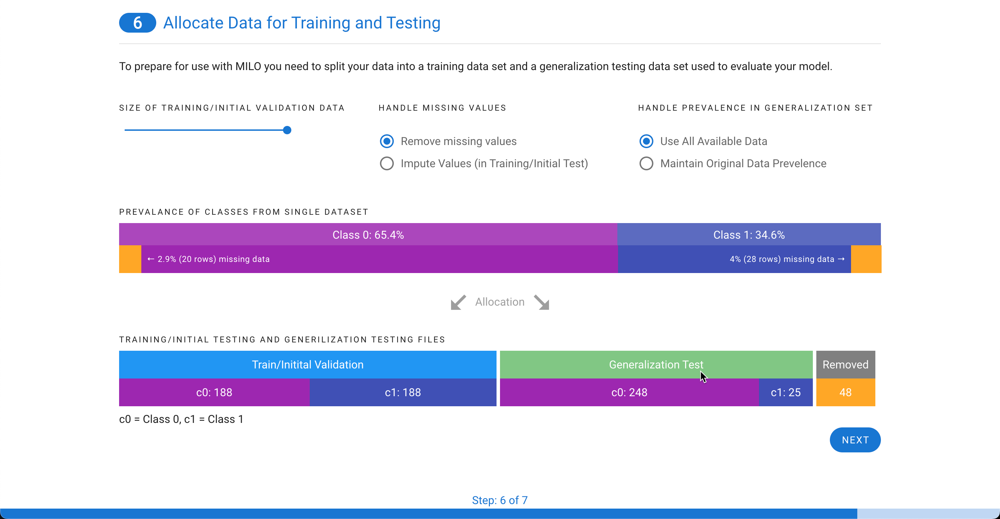
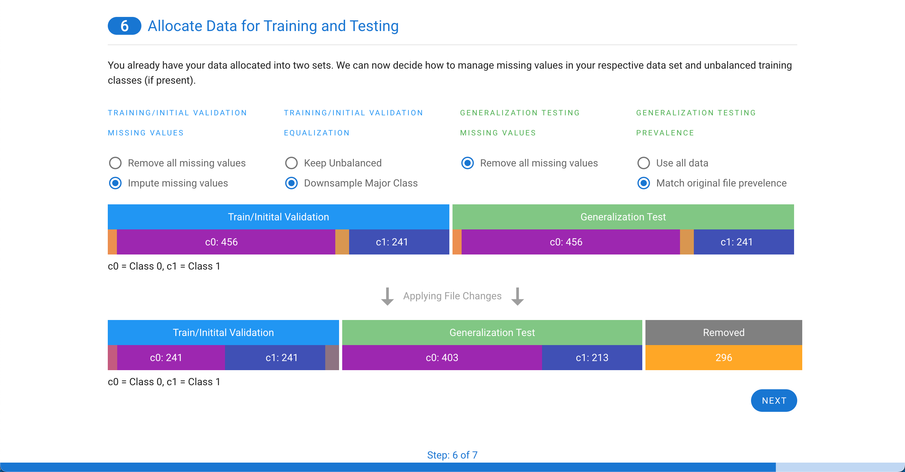
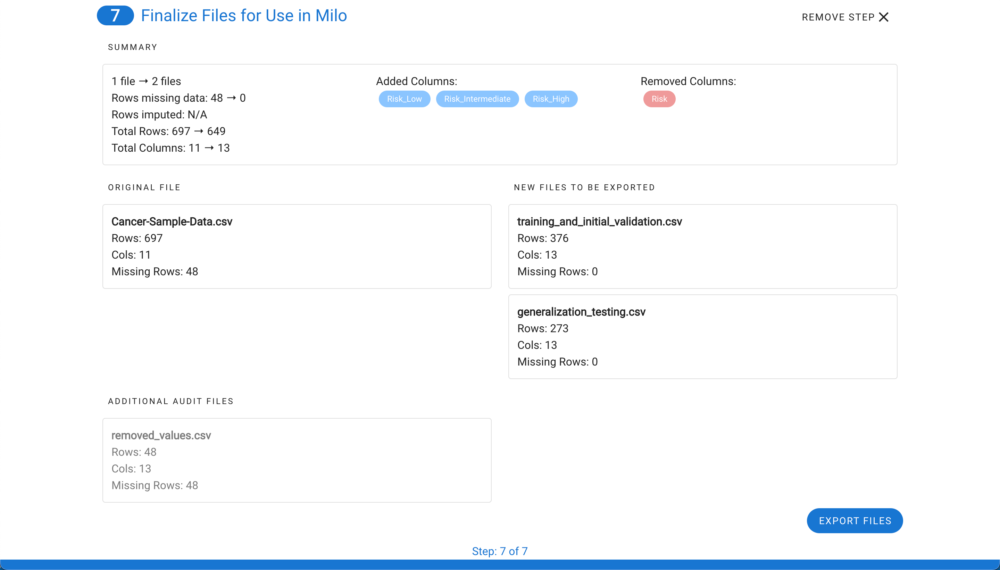
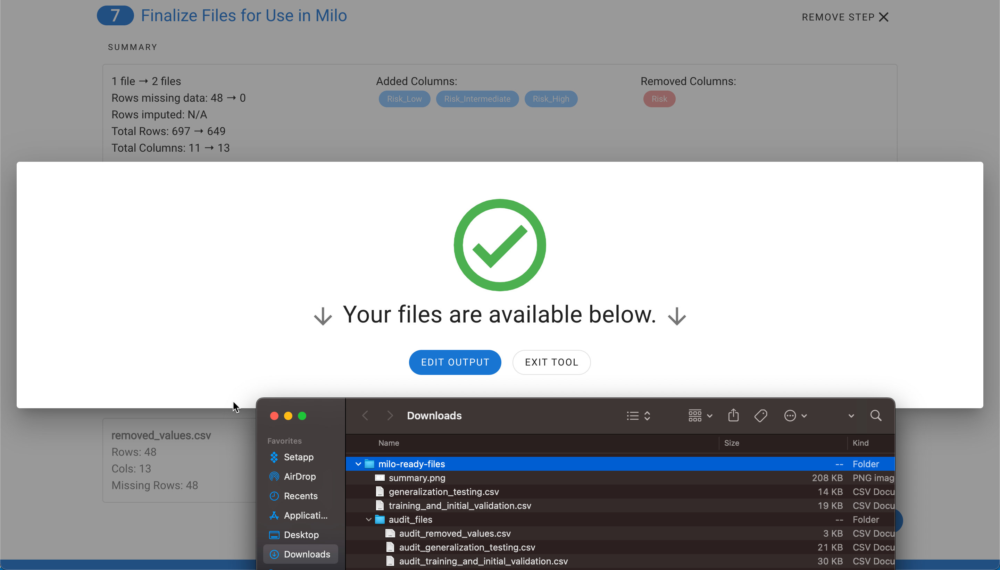

# Automated Preprocessing Tool  <span class="badge-style">MILO Pro</span>

A unique and powerful data preprocessing tool that dramatically streamlines the key steps in your Pre-Machine Learning dataset preparation pipeline by combining all our individual preprocessing Apps along with some powerful new functionalities.

* The tool allows you to work with either a single or multiple datasets (i.e. an already segmented pair of training/initial validation and generalization testing data sets)
*  The tool allows you to encode (i.e. replace) non-numerical columns (e.g. Text) to numeric representations as well as detect when a numerical column has a few abnormal non-numerical values needing removal.
*  The tool allows you to segment the data into the necessary training/initial validation and generalization testing data sets, 
*  The tool enables you to iteratively Impute (i.e. replace through inference) the missing values (through our integrated powerful imputation tool) or remove the rows with missing values, depending on your methodology and study needs.
*  The tool also enables you to assess the multicollinearity of the dataset features and remove highly correlated columns (i.e. features) when needed.
*  **NEW**: Full support for multi-class classification problems with 3 or more classes, including intelligent class balancing and custom class labeling

The example below (a sample dataset) shows a dataset in need of multiple preprocessing (i.e. cleaning) tasks. The multiple missing and NaN values (highlighted in yellow) will need to be either imputed or removed and the non-numerical values (i.e. text that are highlighted in red) will need to be converted to appropriate numerical counterparts. Additionally, the features with high correlations (multicollinearity) will potentially need to be removed. MILO Pro's APT is able to address all these data cleaning tasks in a very intuitive and powerful seamless process, supporting both binary and multi-class scenarios. 


Navigate to the **Preprocessing Tools** from the MILO home page and then select the **Automated Preprocessing Tool**.
 


Start by selecting a single data file or upload your already combined training/initial validation and generalization testing data sets. If you upload two data sets, you will be asked to pick which data file corresponds to which of the two types of datasets. 



The target (or outcome) must also be specified. **MILO-ML now supports both binary classification (2 classes) and multi-class classification (3+ classes)**. The target should contain numerical values:
- **Binary**: 0 and 1 (e.g., No Disease vs Disease)
- **Multi-class**: 0, 1, 2, 3, etc. (e.g., Healthy vs Mild vs Moderate vs Severe)

 

 The next step allows for quick review of the descriptive stats for each feature **and comprehensive class distribution analysis for multi-class problems**. 

**Multi-class Distribution Analysis (APT Exclusive Feature)**:
- **Class Frequency Histograms**: Visual representation of each class distribution
- **Balance Assessment Dashboard**: Identifies severely imbalanced classes  
- **Missing Data by Class**: Shows how data quality varies across classes
- **Stratified Statistics**: Separate descriptive statistics per class
- **Prevalence Analysis**: Percentage breakdown of each class
- **Sample Adequacy Check**: Ensures minimum samples per class (25+ recommended)

```
Example Multi-class Distribution Report:
├── Class 0 (Healthy): 1,245 samples (31.2%) ✓ Adequate
├── Class 1 (Mild): 1,089 samples (27.3%) ✓ Adequate  
├── Class 2 (Moderate): 987 samples (24.7%) ✓ Adequate
├── Class 3 (Severe): 667 samples (16.7%) ⚠ Imbalanced
└── Missing Data Impact: 3.2% average across classes
```

 

Next, the file(s) will be assessed for having a valid target with the appropriate number of classes (minimum 2 for binary, 3+ for multi-class as seen here). **The tool now automatically detects your classification type and provides appropriate options**.

**For Binary Classification:**
- Ensures exactly 2 unique values (0 and 1)
- Provides option to map text values to binary format

**For Multi-class Classification:**
- Detects 3 or more classes (0, 1, 2, 3...)
- Supports custom class labels for better interpretability
- Validates class distribution and balance

The tool also will provide the option to decide how the target values are encoded and labeled. The tool will also check to ensure if two files are used, that the columns match between the files. The final check is to ensure there is enough data to be used within MILO with adequate representation of all classes.


Next, if missing values are present in the data, each column is assessed to evaluate the contribution. Sometimes, a single column is particularly sparse with data and is best to remove from the data set. In this example, only 48 rows are missing data from about 700 cases (as shown in step 1). Although, these can be removed in real life, in this case for demonstration purpose, these are later on imputed to highlight this tool within APT. Additionally, in this case one of the features (i.e. "bare_nucleoli") was responsible for 21% of the missing values so this feature was selected for removal which decreased the number of rows with missing values to 33 (as shown in step 3).


Now the real power of the tool starts. MILO can only use numerical representations of the data. Categorical values or columns with a few non-numerical values cannot be used and will automatically be transformed. Each row needing processing is highlighted with a default choice made for you. 

**Enhanced Multi-class Support:**
- **Binary Categorical Data**: Automatically suggests binary encoding for 2-value categories
- **Multi-class Categorical Data**: Offers one-hot encoding for 3+ categories  
- **Smart Detection**: Intelligently recognizes ordinal vs nominal categorical data
- **Custom Label Mapping**: Allows meaningful names for categories

In the example below, a categorical column is one-hot encoded into multiple columns with binary representations (which better represents the initial feature values as shown in step 4).


The next step depends on if you have a single file or two files.

**If you have a single file**, you will be given the choice on how to split your data into a training/initial validation file and a generalization testing file. 

**Enhanced Multi-class Features:**
- **Class Balance Analysis**: Shows distribution across all classes
- **Stratified Splitting**: Maintains class proportions in both files
- **Minimum Class Size**: Ensures adequate samples per class (minimum 25 per class)
- **Smart Balancing**: Options to balance classes or maintain original distribution

Missing values can either be removed or imputed. Imputed values can only be included in the training/initial validation file and based on the settings you choose, we will recalculate and adjust the possible distribution of cases between the two files (as shown in step 5). You can also decide how to determine the prevalence in the generalize testing file. You can either use all available data or match the prevalence of the original file.



**If you have two files**, the training/initial validation file can either have missing values removed or imputed. 

**Multi-class Enhancements:**
- **Class Distribution Validation**: Ensures both files have all necessary classes
- **Cross-file Consistency**: Validates that class mappings are consistent between files
- **Balanced Training Options**: Choose to equalize classes or maintain natural distribution
- **Class-aware Sampling**: Intelligent sampling that respects class boundaries

For the generalization testing file, any missing values must be removed and, like the single file option above, you can either use all data or match the prevalence of the original file.



You now have a few choices. You can either export your files or run a multicollinearity assessment on the features and remove any correlated columns (i.e. features) before generating your final files. For details on this step, see the [Multicollinearity Assessment & Removal Tool](./multicollinearity.md) documentation.


Once selecting **Export Files**, you will see a summary of all the changes (see step 6) that were made and the files will be downloaded into a zip file.

**Enhanced Multi-class Summary:**
- **Class Distribution Report**: Shows final class counts and percentages
- **Balance Assessment**: Indicates if classes are balanced or imbalanced
- **Custom Label Mapping**: Documents any custom labels applied
- **Validation Warnings**: Alerts for potential issues (e.g., very small classes)



The zip file contains training_and_initial_validation.csv file, generalization_testing.csv, and summary.png which is a snapshot of the final step summary. An audit folder is also included which maps the original files and rows (corresponding separate files display the details on any removed rows or imputed rows for closer evaluation). 

**Enhanced Multi-class Outputs:**
- **Class Mapping File**: Documents the relationship between numerical codes and class labels
- **Distribution Analysis**: CSV showing class balance statistics
- **Validation Report**: Summary of any data quality issues detected

**Please note, the audit rows match Excel's index method of labeling the column names as row 1 and the first data row as row 2.**



## Multi-class Specific Features

### Class Detection and Validation
- **Automatic Detection**: Tool automatically identifies whether your problem is binary (2 classes) or multi-class (3+ classes)
- **Class Validation**: Ensures adequate samples per class for reliable modeling
- **Missing Class Detection**: Identifies if any expected classes are missing from your data

### Custom Class Labels
- **Meaningful Names**: Replace numerical codes (0, 1, 2) with descriptive labels ("Healthy", "Mild", "Severe")
- **Consistent Mapping**: Labels are applied consistently across all output files
- **Export Documentation**: Mapping between codes and labels is saved for reference

### Class Balance Management
- **Distribution Analysis**: Visual and statistical analysis of class distribution
- **Balancing Options**: Choose to equalize classes or maintain natural distribution
- **Sampling Strategies**: Intelligent stratified sampling that preserves class relationships
- **Minimum Thresholds**: Ensures each class meets minimum sample requirements

### Advanced Multi-class Options
- **Ordinal vs Nominal**: Specify whether your classes have a natural order
- **Class Grouping**: Option to combine rare classes if appropriate
- **Hierarchical Classes**: Support for nested or hierarchical class structures

<style>
.badge-style {
    background: #2a97f3;
    color: white;
    border-radius: 10px;
    padding: 2px 10px;
    font-size: 14px;
    display: inline-block;
    height: 18px;
    line-height: 18px;
    margin-bottom: 10px;
}
</style>