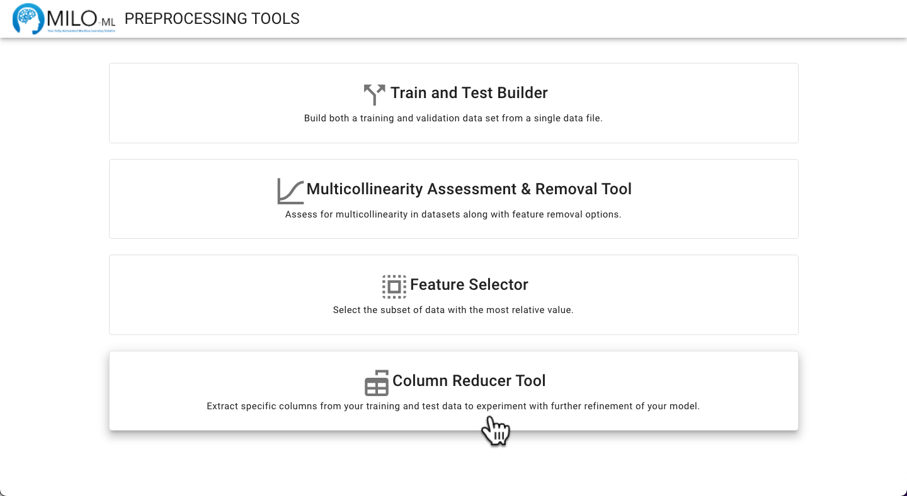
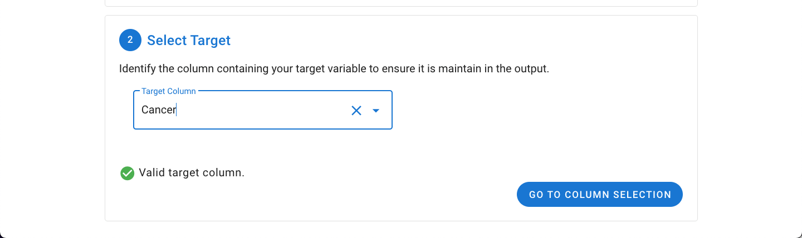
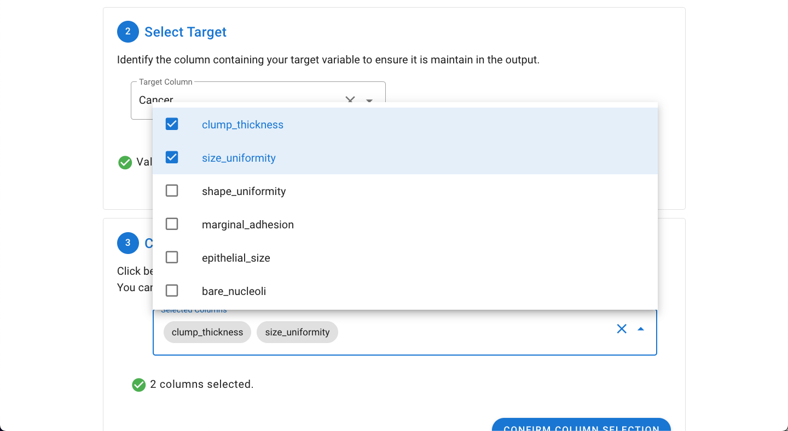
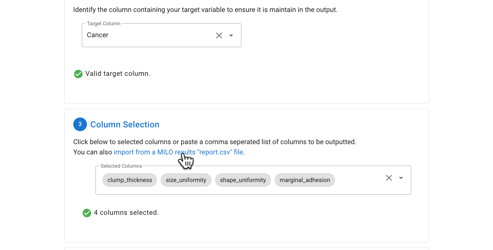
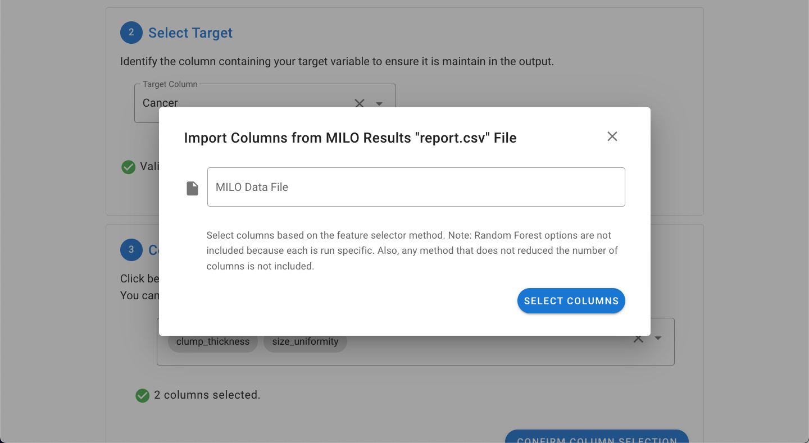
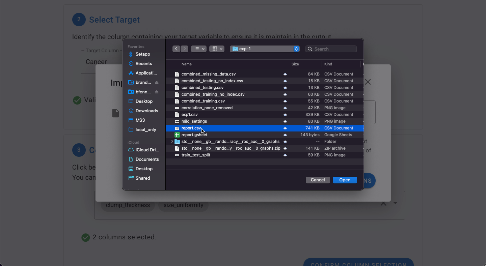
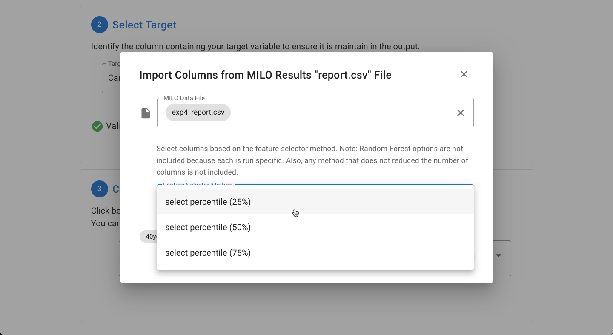
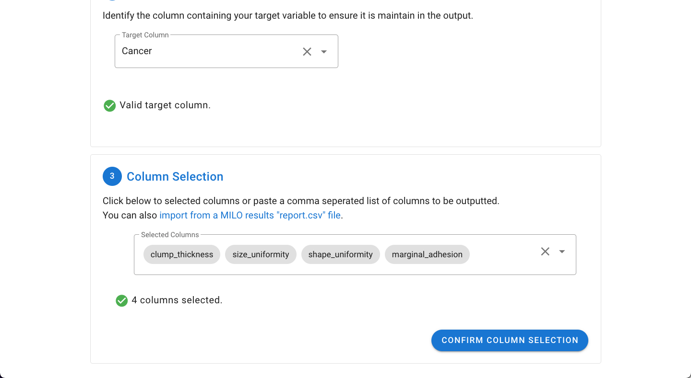
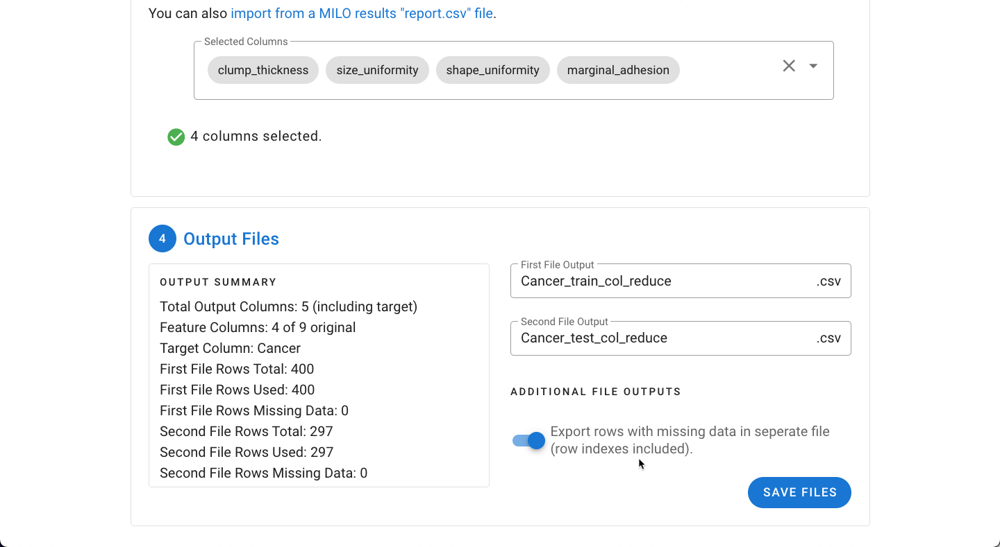
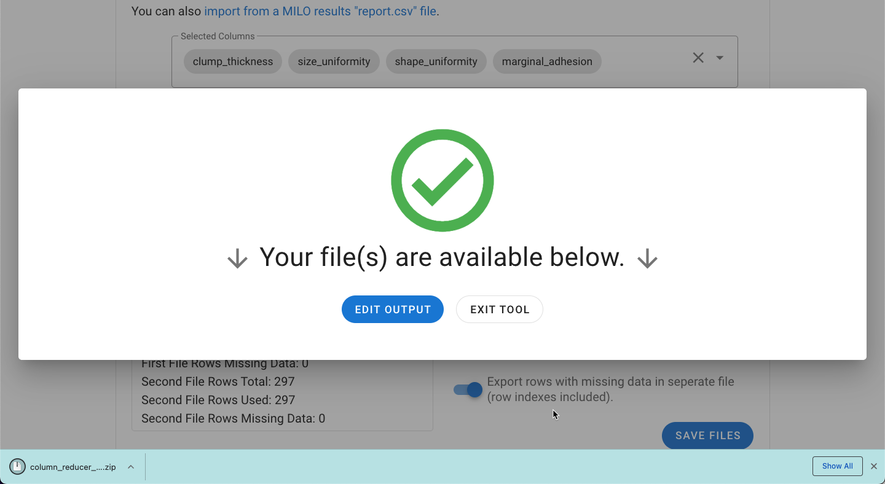

# Column Reducer Tool

Allows the removal of specific “user-defined” columns/features when needed based on one’s expertise.

The Column Removal Tool provides a way to easily remove specific columns from the dataset. As with the other tools,
a single file can be processed, or a pair of training and generalization test files can be processed concurrently.

In certain cases, removing some features from your dataset can sometimes improve performance. This can be done by
specifically selecting certain columns based on intuition (i.e. user domain expertise) or using the report.csv output
from a previous MILO run file to select a specific subset of features with the highest contribution of the overall model.

If the dataset has not been previously used in MILO and the number of columns needs to be reduced, we recommend
employing the [Feature Selector Tool](./feature-selector.md) to reduce the number of features as it uses some of the same
algorithms employed in the MILO run process. If the data has already been used in MILO, then this tool can sometimes help
modify the dataset for further runs.

Navigate to the **Preprocessing Tools** from the MILO home page and then select **Column Reducer Tool**.

Please refer to the [General File Selection Procedure](./general.md) for file selection.

With the target column selected, the desired columns to keep can be selected by clicking the **Go To Column Selection** button.

The desired columns can be selected by pasting in a comma separated list from the clipboard (exported from an earlier MILO
Auto-ML run) which will automatically be parsed or by manually picking the desired columns from the dropdown (as shown below).

As noted above, data from a previous MILO run can also be used by importing the report.csv file. This is done by clicking
on the **import from a MILO results "report.csv" file**.

This will open a dialogue which will allow for selection of the file.

Once the file is imported, the Feature Selector Method can then be picked.

:::warning
Only **Select Percentile** options are available in this report.csv import file option since Random Forest Feature Importance
is non-deterministic and could fluctuate on each specific run.
:::

Once the desired columns are selected, click the **Confirm Column Selection** button to finalize the output.

In the final step, a summary of the files will be displayed including the number of output columns, rows, and excluded missing rows.
The rows with missing data can be explored as a separate file under "Additional File Outputs".

Upon clicking **Save Files**, the file(s) will be exported as a ZIP file and are now ready to be used in the MILO Auto-ML tool.

