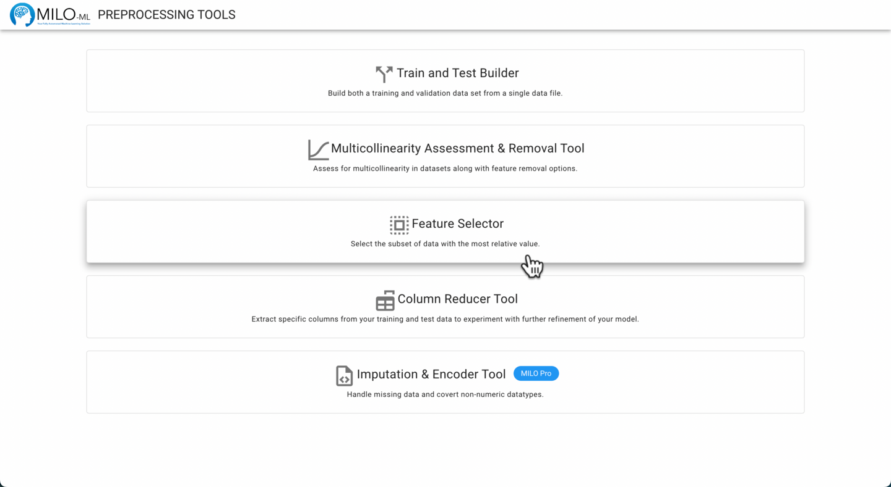
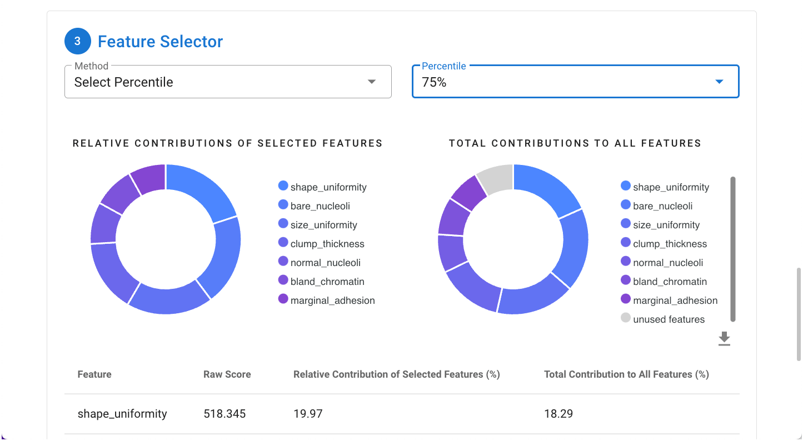
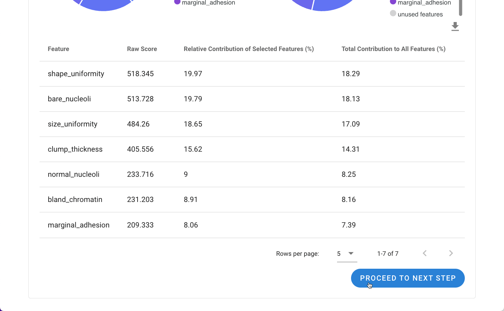
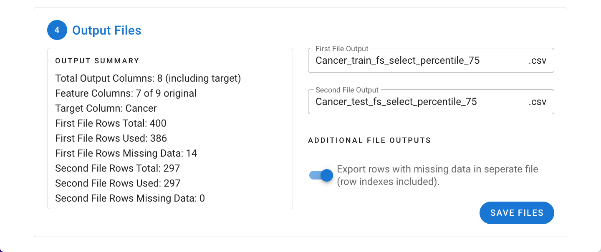
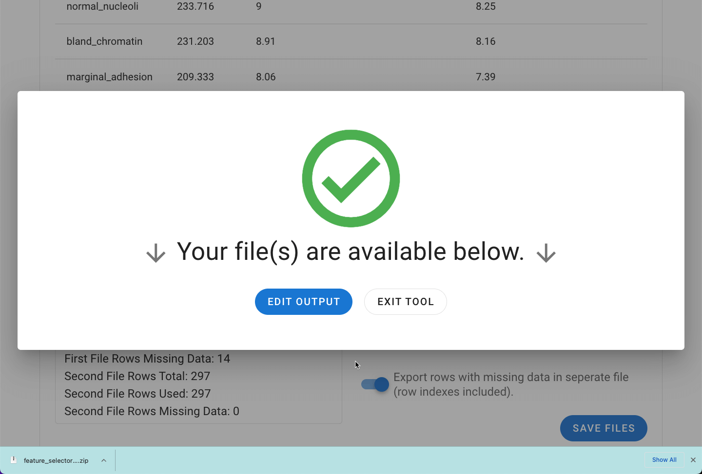

# Feature Selector Tool

- Allows you to assess and select the statistical contributions of the independent variables to the target/outcome variable
through two different methods (an ANOVA F value approach and the Random Forest Importances method). This will ultimately
allow you to visualize and select for the most significant features within your dataset when necessary and potentially reduce
the data volume through removal of potentially redundant features.

- This tool provides a way to easily reduce the number of features present in the set by determining those features with the
largest overall contribution to the target. This tool is best used independently assess the feature contributions to the
target/outcome (usually prior to the MILO Auto-ML run).

Navigate to the **Preprocessing Tools** from the MILO home page and then select the **Feature Selector** tool.

With the target column selected, the value of each feature can be calculated by clicking the **Calculate Feature Value** button.

The method of determining the feature selector can then be specified, either Select Percentile or Random Forest Feature Importances.
Additionally, the percentile of the top features used can be specified (25, 50, 75). An option for 100% is provided to allow for
comparison, but will not change your data unless you have missing rows. The relative contribution of each feature to the assigned
target (outcome) in the dataset are then graphed. In the example, by selecting 75% of the most valuable features, >90% of the
overall data contributions are represented.

A tabular form of the data is also made available below the graph. The data can be downloaded using the download icon between
the graph and table on the right of the screen. With the desired feature selection method and percentile chosen, the dataset(s)
can be finalized by clicking on **Proceed to Next Step**.

In the final step, a summary of the files will be displayed including the number of output columns, rows, and excluded missing
rows. The rows with missing data can be explored as a separate file under "Additional File Outputs".

Upon clicking Save Files, the file(s) will be exported as a ZIP file and are now ready to be used in the MILO Auto-ML tool.

