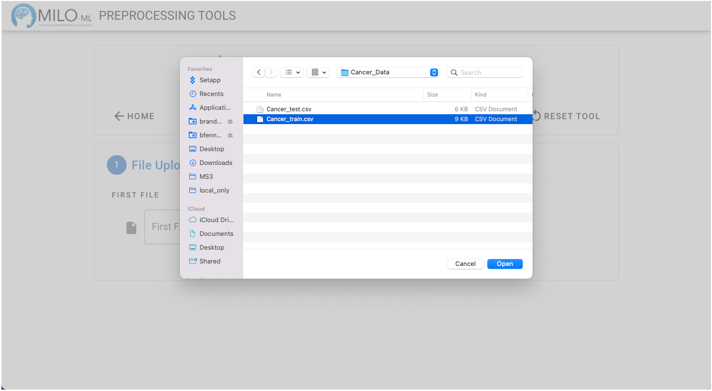
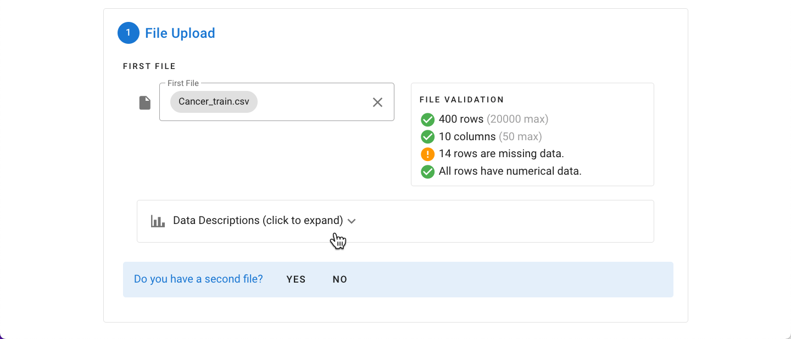
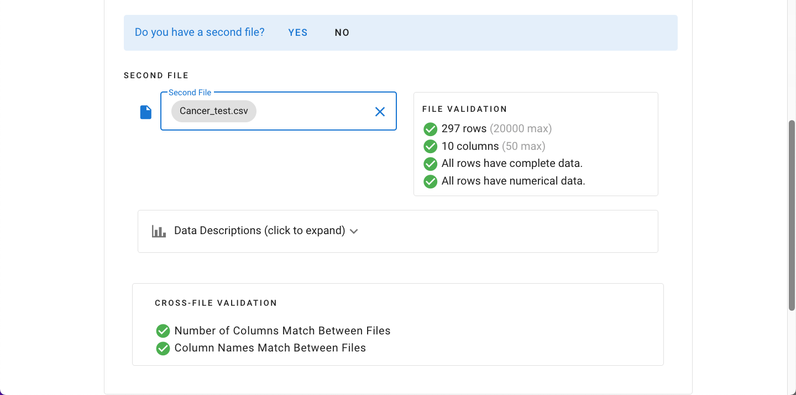
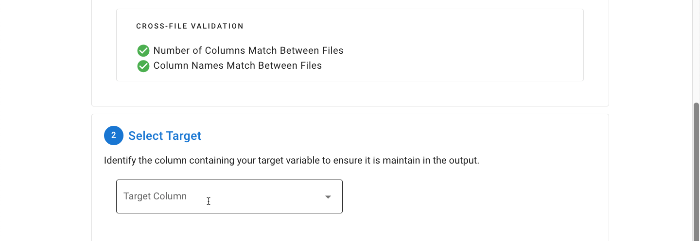

# General File Selection Procedure

This section applies to the remaining preprocessing tools described after (e.g. [Multicollinearity Assessment & Removal Tool](./multicollinearity.md),
[Feature Selector](./feature-selector.md) and [Column Reducer](./column-reducer.md)

As with the other tools, a single file can be processed, or a pair of training and generalization test files can
be processed concurrently. In this example, we’ll use the Example Breast Cancer Data Set which has a training file
and testing file (these sample datasets can be obtained directly from MILO’s user guide). Start by selecting the
first file.

Choose your file from the folder of interest (example below reflects MacOS folder system).

The file is automatically checked to identify any rows with missing data which cannot be used in MILO. Additionally,
the data is checked to ensure that all of the data is numerical. An expandable “Data Descriptions” pane can initially
give you some univariate analysis about each of the variables within the data file (this includes detailed information
about their mean, min, max, skew, quartiles, and number of items in each column).

In this example, a second generalized dataset accompanies the original training file, so we will indicate that there
is a second file present by clicking “Yes”.The testing dataset (i.e. Second File) can then be selected using the same
process as shown above. The same validation procedures are run, and, in addition, the two files are compared to ensure
they have the same number of columns and same column names.

Next, the target (outcome) column is selected from the dropdown. The column names are shown in reverse order with the
assumption that the target column will be located farthest to the right / last column in the data file.

