# Imputation & Encoder Tool (MILO Pro)
- A unique and powerful tool that dramatically expedites your Pre-Machine Learning dataset preparation / cleaning  process. 

- It allows you to iteratively Impute missing values (with our  powerful imputation tool) while also allowing the simultaneous conversion of your text data within your dataset to numerical values (when needed) through our combined encoder platform (which converts columns with non-numerical data into numeric values). 

In order for a dataset to be used in MILO, the data needs to be numerically represented (i.e. No text) and missing values must also be removed or filled-in appropriately through statistically sounds processes (imputed). The Pro version of MILO offers a very powerful and unique tool to handle both these tasks simultaneously (iterative imputation and text conversion through the encoder). These steps are automated through this App as shown below. This is how it works:

Navigate to the **Preprocessing Tools** from the MILO home page and then select the **Imputation & Encoder Tool**.

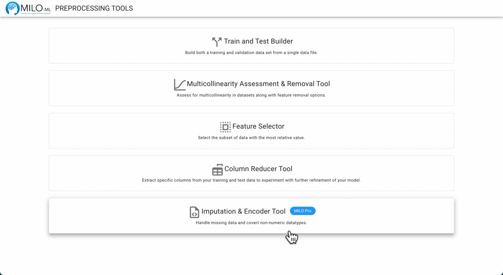

Start by selecting the dataset(s) of interest. You may use a single data set, or, if you have multiple data files you can process them all together. However, imputation should not be applied to generalization test data and should be only confined to one’s training/initial validation data. So, as a general rule, one should only use this tool for a single data file, specifically the training dataset only (to ensure more realistic performance measures from one’s final ML model). 

:::tip
The data files must be in a CSV file format. Excel, Keynote, Google Docs or other database tools allow you to save the file in this format. The column names and number of columns should also match between the files if processing multiple files.
:::

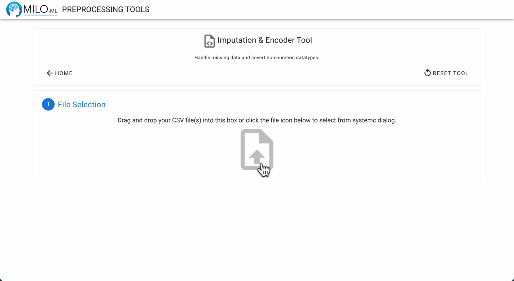

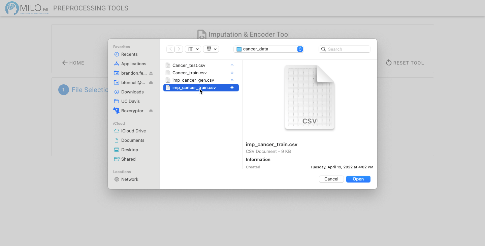

Next, select your target column from the dropdown (as shown below).

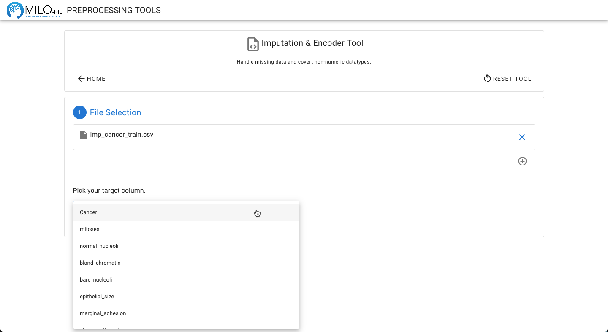

Click the  **Evaluate Files** button to analyze your files. 

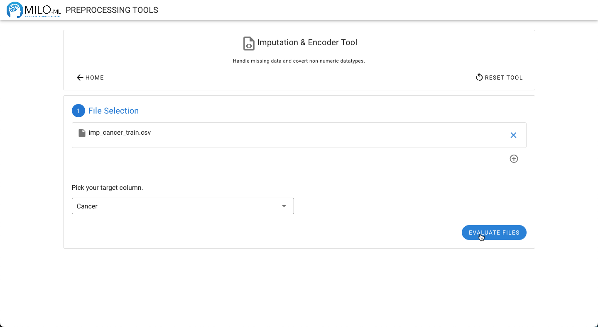

Data regarding the number of rows, columns, and missing values will be displayed.

:::tip
If your dataset has missing values and more than 2000 rows or 50 columns, imputation can take a significant amount of time, depending on the performance of your computer. You may see a warning about this while your files are being analyzed. The decision to use imputation will be covered later in this tutorial.
:::

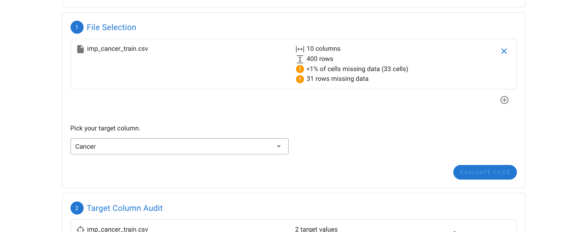

The next step is to evaluate the target column. The target column needs to only have two values. If the values are not designated 0 and 1, an option on how to encode the two values to 0 and 1 will be provided. This can be manually adjusted (as shown below).

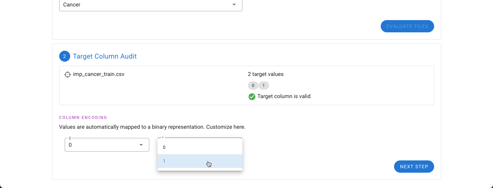

Next, if the dataset is missing data, the features with the most missing data will be shown graphically. If one or several features (columns) appear to have significant amounts of missing data, it may be beneficial to remove the feature (column). Any columns to be removed can be selected under the “Column Removal” drop down.

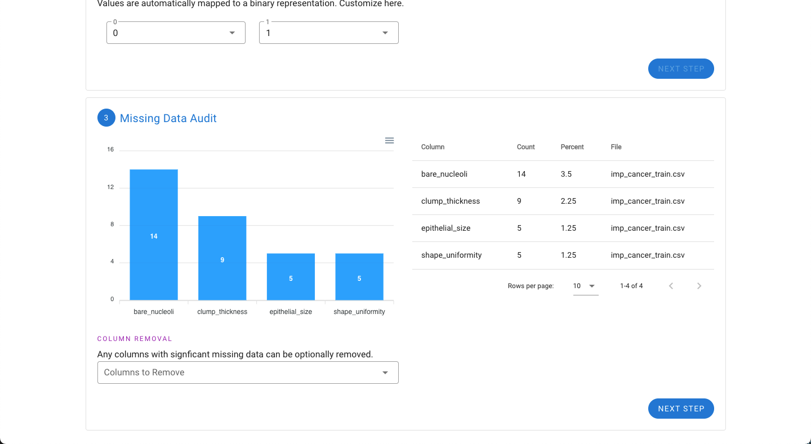

Next, if the dataset has features that have non-numerical values such as text or letters (e.g. categories A, B, C, D, and E), the tool will automatically detect these and convert each category into a separate binary column to give the necessary numeric representation for use in MILO. For example, if there are five possible categories, five columns will be created.

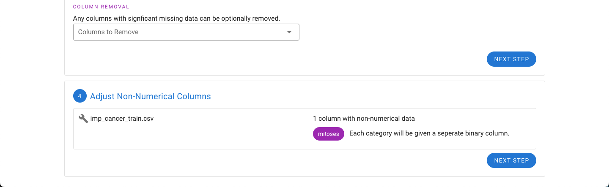

Earlier the option to remove features with significant missing values was provided. If any missing values are still present in the dataset, the option to either impute the missing values or remove the rows with missing values are now presented. 

A summary of the changes to the files are also provided. For the example files, the mitosis feature has been changed into five binary representations of each of the five categories originally found in this feature (A, B, C, D, and E). 

Additionally the number of rows will be decreased because of missing data. Rows that are dropped from the dataset are provided in a separate file automatically.

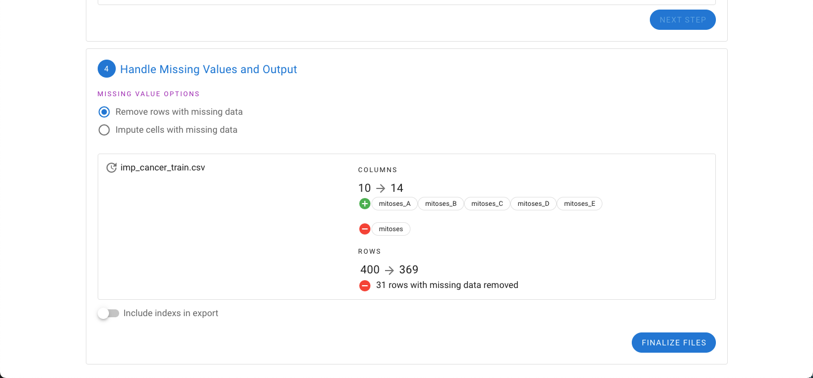

Alternatively, the impute option can be selected. Instead of dropping rows, the missing values are imputed based on the existing data. In either export, the option to include the index of the rows is also provided.

:::tip
If you are processing your Generalization Testing data, we strongly advise against using imputation on this data set. We only recommend use of imputation on training data.
:::
:::tip
If your dataset has more than 30% missing values, we advise against using imputation as the imputed values can more significantly distort your model.
:::

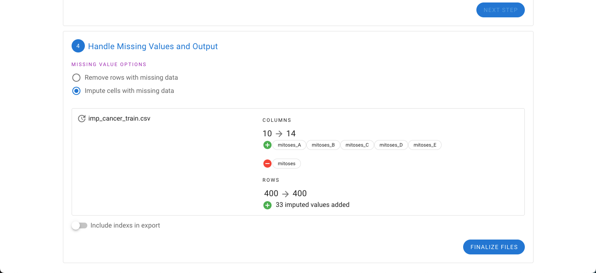

Finally, selecting “Finalize Files” will generate a zip file with the output.

:::warning
As noted above, if your dataset is >2000 rows or >50 features, imputation can take significant time to complete.
:::

