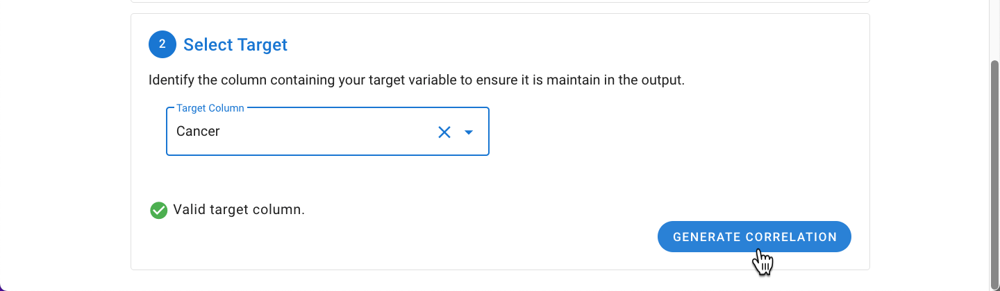
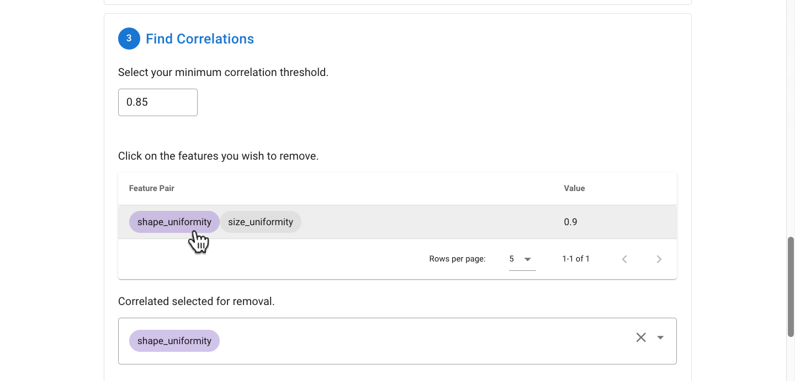
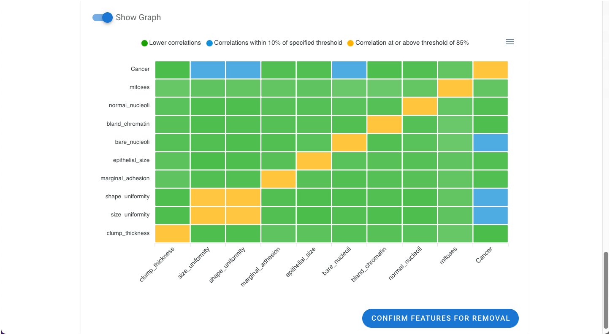
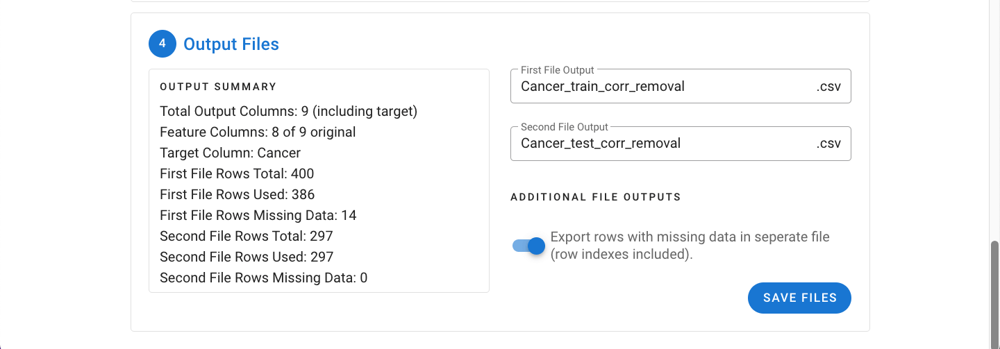
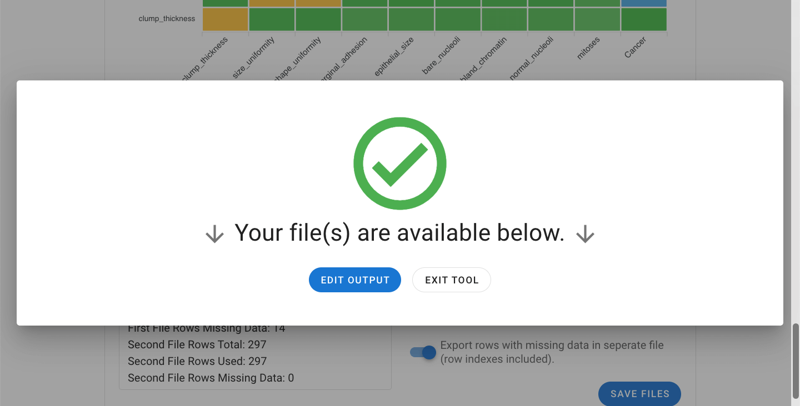

# Multicollinearity Assessment & Removal Tool

Allows you to observe and assess the correlations between the variables and to remove high correlates when deemed appropriate.

In certain datasets, some features may be heavily correlated with one another. Sometimes it may be the same feature listed
more than once under different names. As you can imagine, especially in datasets with a limited number of features, if certain
features are overrepresented, then the value / contribution of other features within that dataset may become diluted which
ultimately can deteriorate the ML model’s performance measures. In some cases, to include all of the features within a dataset
regardless of their correlations may be desirable. However, evaluating for and removing heavily correlated variables can be
another step in the optimization step of your data which could ensure the appropriate contribution of the unique dimensions
that are represented within the dataset. This can be assessed with the **Multicollinearity Assessment and Removal Tool**.

:::details
The maximum number of features / columns allowed within this tool is 50 since the visualization tool (i.e. the correlation
heat map) is best visualized when the number of features are below 50.
:::

Navigate to the **Preprocessing Tools** from the MILO home page and then select **Multicollinearity Assessment and Removal Tool**.

[General File Selection Procedure](./general.md)

With the target column selected, the correlation can be calculated between all variables by clicking the Generate Correlation
button.

Within this tool, the correlation threshold by default is set to 85% (0.85). This minimum correlation threshold can be adjusted
and the output is a list of correlated columns meeting that assigned threshold. Clicking on a specific column will select it
for removal and it will be color coded to identify all associated pairings within the list. The columns selected for removal
will be down in the dialogue box labeled as "Correlated selected for removal".

Note: If less than 50 columns are present in the dataset, a visual representation of the correlation limit (yellow) and those
pairs which are within 10% of the threshold (blue) will be displayed to help better explore the correlations in the data at
or near the current threshold. Once done exploring with the columns for removal selected, the Confirm Features for Removal
button can be clicked to advance to the final step.

In the final step, a summary of the files will be displayed including the number of output columns, rows, and excluded
missing rows. The rows with missing data can be explored as a separate file under "Additional File Outputs".

Upon clicking Save Files, the file(s) will be exported as a ZIP file and are now ready to be used in MILO.

